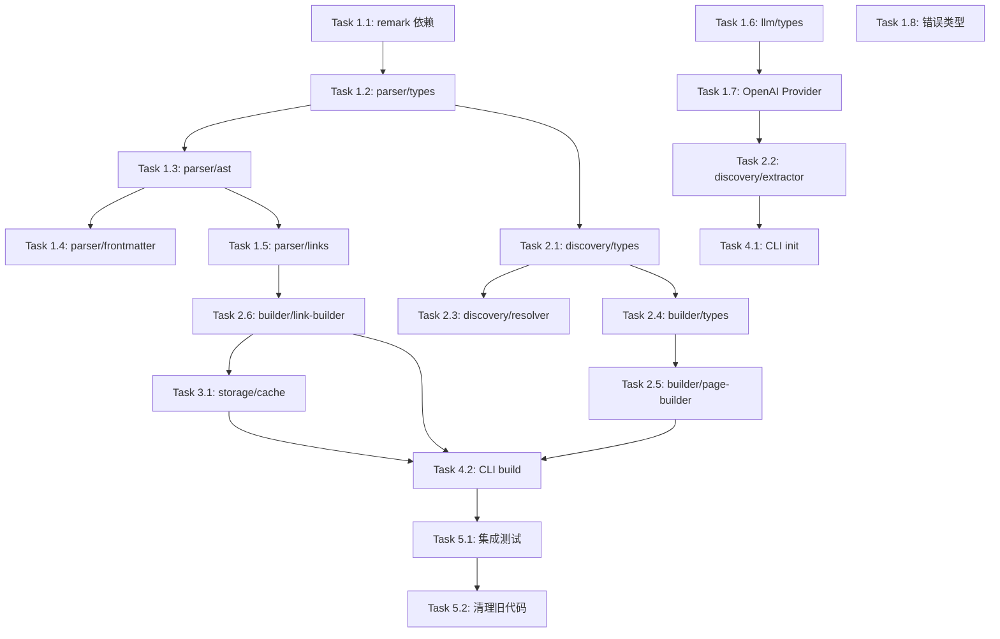

# OntoMark V2 升级实现计划

> **For agentic workers:** REQUIRED SUB-SKILL: Use superpowers:subagent-driven-development (recommended) or superpowers:executing-plans to implement this plan task-by-task. Steps use checkbox (`- [ ]`) syntax for tracking.

**Goal:** 将 OntoMark 从 V1 的单一 Vault 模式升级为 V2 的 LLM Wiki 架构，实现知识编译和实体管理。

**Architecture:** 采用渐进式重构，在现有代码基础上新增 parser、discovery、builder、storage 模块，保留可复用的 LLM 和 schema 逻辑，最终替换 marked 为 remark/unified AST 解析。

**Tech Stack:** TypeScript 5+, Node.js 18+, remark/unified (AST), gray-matter (frontmatter), OpenAI SDK (DeepSeek/OpenAI), Jest (测试)

---

## 文件结构规划

### 新建文件

```
src/
├── parser/
│   ├── ast.ts              # remark AST 工具函数
│   ├── frontmatter.ts      # frontmatter 解析和更新
│   ├── links.ts            # WikiLink 解析和插入
│   └── types.ts            # parser 相关类型
├── discovery/
│   ├── extractor.ts        # 实体提取（增强版）
│   ├── resolver.ts         # 实体消歧
│   └── types.ts            # discovery 相关类型
├── builder/
│   ├── page-builder.ts     # wiki 页面生成（增强版）
│   ├── link-builder.ts     # 链接生成器
│   └── types.ts            # builder 相关类型
├── storage/
│   └── cache.ts            # JSON 缓存管理
└── llm/
    └── openai-provider.ts  # OpenAI provider 实现

tests/
├── parser/
│   ├── ast.test.ts
│   ├── frontmatter.test.ts
│   └── links.test.ts
├── discovery/
│   ├── extractor.test.ts
│   └── resolver.test.ts
├── builder/
│   ├── page-builder.test.ts
│   └── link-builder.test.ts
└── storage/
    └── cache.test.ts
```

### 修改文件

```
src/llm/types.ts            # 添加 AIProvider 统一接口
src/utils/errors.ts         # 添加新错误类型
src/cli.ts                  # 重构为 V2 命令结构
src/index.ts                # 重构为 V2 API
```

### 删除文件（阶段6）

```
src/enhance/                # 整个目录移除
src/index/                  # 整个目录移除
src/wiki/index-builder.ts   # 移至 builder/
```

---

## Phase 1: 基础设施（Week 1-2）

### Task 1.1: 添加 remark 依赖

**Files:**
- Modify: `package.json`

- [ ] **Step 1: 安装 remark 相关依赖**

```bash
npm install unified remark-parse remark-stringify remark-frontmatter unist-util-visit mdast-util-to-string
```

- [ ] **Step 2: 验证依赖安装**

Run: `npm list unified remark-parse remark-stringify remark-frontmatter`
Expected: 显示已安装的版本

- [ ] **Step 3: Commit**

```bash
git add package.json package-lock.json
git commit -m "chore: 添加 remark/unified AST 解析依赖"
```

---

### Task 1.2: 实现 parser/types.ts

**Files:**
- Create: `src/parser/types.ts`
- Create: `tests/parser/types.test.ts`

- [ ] **Step 1: 写失败的测试**

```typescript
// tests/parser/types.test.ts
import { WikiLink, MarkdownNode } from '../../src/parser/types';

describe('parser/types', () => {
  describe('WikiLink', () => {
    it('应该正确定义 WikiLink 类型', () => {
      const link: WikiLink = {
        target: 'JWT',
        text: 'JWT',
        position: { start: 10, end: 16 },
      };
      expect(link.target).toBe('JWT');
      expect(link.text).toBe('JWT');
      expect(link.position.start).toBe(10);
    });
  });

  describe('MarkdownNode', () => {
    it('应该正确定义 MarkdownNode 类型', () => {
      const node: MarkdownNode = {
        type: 'text',
        value: 'Hello',
      };
      expect(node.type).toBe('text');
      expect(node.value).toBe('Hello');
    });
  });
});
```

- [ ] **Step 2: 运行测试验证失败**

Run: `npm test tests/parser/types.test.ts`
Expected: FAIL - 找不到模块

- [ ] **Step 3: 实现类型定义**

```typescript
// src/parser/types.ts
import type { Node } from 'unist';

/**
 * WikiLink 信息
 */
export interface WikiLink {
  /** 链接目标 */
  target: string;
  /** 显示文本 */
  text: string;
  /** 位置信息 */
  position: {
    start: number;
    end: number;
  };
}

/**
 * Markdown 节点（简化版）
 */
export interface MarkdownNode extends Node {
  value?: string;
  children?: MarkdownNode[];
}

/**
 * 解析后的 Markdown 文档
 */
export interface ParsedDocument {
  /** AST 根节点 */
  root: MarkdownNode;
  /** Frontmatter 数据 */
  frontmatter: Record<string, unknown> | null;
  /** 提取的 WikiLinks */
  links: WikiLink[];
  /** 纯文本内容 */
  text: string;
}

/**
 * 链接插入位置
 */
export interface LinkInsertPosition {
  /** 起始偏移 */
  start: number;
  /** 结束偏移 */
  end: number;
  /** 原始文本 */
  text: string;
}
```

- [ ] **Step 4: 运行测试验证通过**

Run: `npm test tests/parser/types.test.ts`
Expected: PASS

- [ ] **Step 5: Commit**

```bash
git add src/parser/types.ts tests/parser/types.test.ts
git commit -m "feat(parser): 添加 parser 类型定义"
```

---

### Task 1.3: 实现 parser/ast.ts

**Files:**
- Create: `src/parser/ast.ts`
- Create: `tests/parser/ast.test.ts`

- [ ] **Step 1: 写失败的测试 - parseMarkdown**

```typescript
// tests/parser/ast.test.ts
import { parseMarkdown, extractText } from '../../src/parser/ast';

describe('parser/ast', () => {
  describe('parseMarkdown', () => {
    it('应该解析纯文本 Markdown', () => {
      const content = '# Hello\n\nThis is a test.';
      const result = parseMarkdown(content);
      
      expect(result.root).toBeDefined();
      expect(result.frontmatter).toBeNull();
      expect(result.links).toEqual([]);
    });

    it('应该解析带 frontmatter 的 Markdown', () => {
      const content = `---
name: Test
type: Concept
---
# Hello`;
      const result = parseMarkdown(content);
      
      expect(result.frontmatter).toEqual({
        name: 'Test',
        type: 'Concept',
      });
    });
  });

  describe('extractText', () => {
    it('应该从 AST 提取纯文本', () => {
      const content = '# Title\n\nParagraph with **bold** text.';
      const doc = parseMarkdown(content);
      const text = extractText(doc.root);
      
      expect(text).toContain('Title');
      expect(text).toContain('Paragraph with bold text');
    });
  });
});
```

- [ ] **Step 2: 运行测试验证失败**

Run: `npm test tests/parser/ast.test.ts`
Expected: FAIL - 找不到模块

- [ ] **Step 3: 实现 parseMarkdown 和 extractText**

```typescript
// src/parser/ast.ts
import { unified } from 'unified';
import remarkParse from 'remark-parse';
import remarkFrontmatter from 'remark-frontmatter';
import remarkStringify from 'remark-stringify';
import { visit } from 'unist-util-visit';
import { toString } from 'mdast-util-to-string';
import type { Root, Content } from 'mdast';
import { ParsedDocument, MarkdownNode, WikiLink } from './types';

/**
 * 解析 Markdown 内容为 AST
 */
export function parseMarkdown(content: string): ParsedDocument {
  const tree = unified()
    .use(remarkParse)
    .use(remarkFrontmatter, ['yaml'])
    .parse(content) as Root;

  // 提取 frontmatter
  let frontmatter: Record<string, unknown> | null = null;
  visit(tree, 'yaml', (node: any) => {
    try {
      // 简单解析：使用 yaml 库
      const yaml = require('yaml');
      frontmatter = yaml.parse(node.value);
    } catch {
      frontmatter = null;
    }
  });

  // 提取文本
  const text = extractText(tree as MarkdownNode);

  // 提取链接（暂不实现，在 links.ts 中实现）
  const links: WikiLink[] = [];

  return {
    root: tree as MarkdownNode,
    frontmatter,
    links,
    text,
  };
}

/**
 * 从 AST 提取纯文本
 */
export function extractText(node: MarkdownNode): string {
  return toString(node as any);
}

/**
 * 将 AST 序列化为 Markdown
 */
export function stringifyMarkdown(node: MarkdownNode): string {
  const processor = unified().use(remarkStringify);
  const result = processor.stringify(node as any);
  return String(result);
}
```

- [ ] **Step 4: 运行测试验证通过**

Run: `npm test tests/parser/ast.test.ts`
Expected: PASS

- [ ] **Step 5: Commit**

```bash
git add src/parser/ast.ts tests/parser/ast.test.ts
git commit -m "feat(parser): 实现 parseMarkdown 和 extractText"
```

---

### Task 1.4: 实现 parser/frontmatter.ts

**Files:**
- Create: `src/parser/frontmatter.ts`
- Create: `tests/parser/frontmatter.test.ts`

- [ ] **Step 1: 写失败的测试**

```typescript
// tests/parser/frontmatter.test.ts
import { 
  parseFrontmatter, 
  updateFrontmatter,
  validateFrontmatter 
} from '../../src/parser/frontmatter';

describe('parser/frontmatter', () => {
  describe('parseFrontmatter', () => {
    it('应该解析有效的 frontmatter', () => {
      const content = `---
name: JWT
type: Concept
aliases:
  - JSON Web Token
---
# JWT`;
      
      const result = parseFrontmatter(content);
      
      expect(result.data.name).toBe('JWT');
      expect(result.data.type).toBe('Concept');
      expect(result.data.aliases).toEqual(['JSON Web Token']);
    });

    it('应该处理没有 frontmatter 的内容', () => {
      const content = '# No frontmatter';
      const result = parseFrontmatter(content);
      
      expect(result.data).toEqual({});
    });
  });

  describe('updateFrontmatter', () => {
    it('应该更新现有 frontmatter', () => {
      const content = `---
name: Old
---
# Title`;
      
      const updated = updateFrontmatter(content, { name: 'New', added: 'value' });
      
      expect(updated).toContain('name: New');
      expect(updated).toContain('added: value');
    });

    it('应该添加 frontmatter 到没有的内容', () => {
      const content = '# Title';
      const updated = updateFrontmatter(content, { name: 'New' });
      
      expect(updated).toContain('---');
      expect(updated).toContain('name: New');
    });
  });

  describe('validateFrontmatter', () => {
    it('应该验证必需字段', () => {
      const valid = validateFrontmatter({ name: 'Test', type: 'Concept' }, ['name', 'type']);
      expect(valid).toBe(true);
    });

    it('应该检测缺失字段', () => {
      const valid = validateFrontmatter({ name: 'Test' }, ['name', 'type']);
      expect(valid).toBe(false);
    });
  });
});
```

- [ ] **Step 2: 运行测试验证失败**

Run: `npm test tests/parser/frontmatter.test.ts`
Expected: FAIL - 找不到模块

- [ ] **Step 3: 实现 frontmatter 函数**

```typescript
// src/parser/frontmatter.ts
import matter from 'gray-matter';
import { parseMarkdown, stringifyMarkdown } from './ast';
import { MarkdownNode } from './types';

/**
 * 解析 frontmatter
 */
export function parseFrontmatter(content: string): {
  data: Record<string, unknown>;
  content: string;
} {
  const result = matter(content);
  return {
    data: result.data as Record<string, unknown>,
    content: result.content,
  };
}

/**
 * 更新 frontmatter
 */
export function updateFrontmatter(
  content: string,
  updates: Record<string, unknown>
): string {
  const result = matter(content);
  const newData = { ...result.data, ...updates };
  return matter.stringify(result.content, newData);
}

/**
 * 验证 frontmatter 是否包含必需字段
 */
export function validateFrontmatter(
  data: Record<string, unknown>,
  requiredFields: string[]
): boolean {
  return requiredFields.every(field => data[field] !== undefined);
}

/**
 * 从 AST 提取 frontmatter 数据
 */
export function extractFrontmatter(node: MarkdownNode): Record<string, unknown> | null {
  if (!node.children) return null;
  
  for (const child of node.children) {
    if (child.type === 'yaml' && 'value' in child) {
      try {
        const yaml = require('yaml');
        return yaml.parse(child.value as string);
      } catch {
        return null;
      }
    }
  }
  
  return null;
}
```

- [ ] **Step 4: 运行测试验证通过**

Run: `npm test tests/parser/frontmatter.test.ts`
Expected: PASS

- [ ] **Step 5: Commit**

```bash
git add src/parser/frontmatter.ts tests/parser/frontmatter.test.ts
git commit -m "feat(parser): 实现 frontmatter 解析和更新"
```

---

### Task 1.5: 实现 parser/links.ts

**Files:**
- Create: `src/parser/links.ts`
- Create: `tests/parser/links.test.ts`

- [ ] **Step 1: 写失败的测试**

```typescript
// tests/parser/links.test.ts
import { 
  extractWikiLinks, 
  insertWikiLink,
  findAllLinkableText 
} from '../../src/parser/links';
import { parseMarkdown } from '../../src/parser/ast';

describe('parser/links', () => {
  describe('extractWikiLinks', () => {
    it('应该提取 [[WikiLink]] 格式的链接', () => {
      const content = 'This links to [[JWT]] and [[OAuth]].';
      const doc = parseMarkdown(content);
      const links = extractWikiLinks(doc.root);
      
      expect(links).toHaveLength(2);
      expect(links[0].target).toBe('JWT');
      expect(links[1].target).toBe('OAuth');
    });

    it('应该提取带显示文本的链接 [[target|text]]', () => {
      const content = 'See [[JWT|JSON Web Token]].';
      const doc = parseMarkdown(content);
      const links = extractWikiLinks(doc.root);
      
      expect(links).toHaveLength(1);
      expect(links[0].target).toBe('JWT');
      expect(links[0].text).toBe('JSON Web Token');
    });
  });

  describe('insertWikiLink', () => {
    it('应该在指定位置插入链接', () => {
      const content = 'This mentions JWT here.';
      const doc = parseMarkdown(content);
      
      // 找到 "JWT" 的位置
      const position = content.indexOf('JWT');
      const updated = insertWikiLink(content, position, position + 3, 'JWT');
      
      expect(updated).toBe('This mentions [[JWT]] here.');
    });

    it('不应该重复链接已有的链接', () => {
      const content = 'This has [[JWT]] already.';
      const position = content.indexOf('JWT');
      const updated = insertWikiLink(content, position, position + 3, 'JWT');
      
      // 应该保持不变
      expect(updated).toBe('This has [[JWT]] already.');
    });
  });

  describe('findAllLinkableText', () => {
    it('应该找到所有匹配实体名称的文本位置', () => {
      const content = 'JWT is used. JWT tokens are secure.';
      const entityNames = ['JWT', 'OAuth'];
      const positions = findAllLinkableText(content, entityNames);
      
      expect(positions).toHaveLength(2);
      expect(positions[0].text).toBe('JWT');
      expect(positions[1].text).toBe('JWT');
    });

    it('不应该匹配已在链接中的文本', () => {
      const content = '[[JWT]] is used. JWT tokens are secure.';
      const entityNames = ['JWT'];
      const positions = findAllLinkableText(content, entityNames);
      
      // 只找到第二个 JWT
      expect(positions).toHaveLength(1);
      expect(positions[0].start).toBeGreaterThan(10);
    });
  });
});
```

- [ ] **Step 2: 运行测试验证失败**

Run: `npm test tests/parser/links.test.ts`
Expected: FAIL - 找不到模块

- [ ] **Step 3: 实现 links 函数**

```typescript
// src/parser/links.ts
import { visit } from 'unist-util-visit';
import type { Root, Text } from 'mdast';
import { MarkdownNode, WikiLink, LinkInsertPosition } from './types';

/**
 * WikiLink 正则表达式
 */
const WIKI_LINK_REGEX = /\[\[([^\]|]+)(?:\|([^\]]+))?\]\]/g;

/**
 * 从 AST 提取所有 WikiLinks
 */
export function extractWikiLinks(node: MarkdownNode): WikiLink[] {
  const links: WikiLink[] = [];
  
  visit(node as any, 'text', (textNode: Text) => {
    const text = textNode.value;
    let match;
    
    while ((match = WIKI_LINK_REGEX.exec(text)) !== null) {
      links.push({
        target: match[1],
        text: match[2] || match[1],
        position: {
          start: match.index,
          end: match.index + match[0].length,
        },
      });
    }
  });
  
  return links;
}

/**
 * 在指定位置插入 WikiLink
 */
export function insertWikiLink(
  content: string,
  start: number,
  end: number,
  target: string
): string {
  const before = content.slice(0, start);
  const after = content.slice(end);
  const text = content.slice(start, end);
  
  // 检查是否已经在链接中
  const contextBefore = before.slice(-20);
  const contextAfter = after.slice(0, 20);
  
  // 如果前面是 [[ 或后面是 ]]，不处理
  if (contextBefore.includes('[[') && !contextBefore.includes(']]')) {
    return content;
  }
  
  // 如果文本本身就是链接语法的一部分
  if (text.startsWith('[[') || text.endsWith(']]')) {
    return content;
  }
  
  return `${before}[[${target}]]${after}`;
}

/**
 * 找到所有可链接的文本位置
 */
export function findAllLinkableText(
  content: string,
  entityNames: string[]
): LinkInsertPosition[] {
  const positions: LinkInsertPosition[] = [];
  
  // 找出所有已链接的位置
  const linkedRanges: Array<{ start: number; end: number }> = [];
  let match;
  while ((match = WIKI_LINK_REGEX.exec(content)) !== null) {
    linkedRanges.push({
      start: match.index,
      end: match.index + match[0].length,
    });
  }
  
  // 查找每个实体名称
  for (const name of entityNames) {
    const regex = new RegExp(`\\b${escapeRegex(name)}\\b`, 'g');
    
    while ((match = regex.exec(content)) !== null) {
      const start = match.index;
      const end = start + match[0].length;
      
      // 检查是否在已链接范围内
      const isLinked = linkedRanges.some(
        range => (start >= range.start && start < range.end) ||
                 (end > range.start && end <= range.end)
      );
      
      if (!isLinked) {
        positions.push({
          start,
          end,
          text: match[0],
        });
      }
    }
  }
  
  // 按位置排序（从后往前处理）
  return positions.sort((a, b) => b.start - a.start);
}

/**
 * 转义正则特殊字符
 */
function escapeRegex(str: string): string {
  return str.replace(/[.*+?^${}()|[\]\\]/g, '\\$&');
}

/**
 * 批量插入 WikiLinks
 */
export function insertAllWikiLinks(
  content: string,
  entityNames: string[]
): string {
  const positions = findAllLinkableText(content, entityNames);
  
  let result = content;
  for (const pos of positions) {
    result = insertWikiLink(result, pos.start, pos.end, pos.text);
  }
  
  return result;
}
```

- [ ] **Step 4: 运行测试验证通过**

Run: `npm test tests/parser/links.test.ts`
Expected: PASS

- [ ] **Step 5: Commit**

```bash
git add src/parser/links.ts tests/parser/links.test.ts
git commit -m "feat(parser): 实现 WikiLink 解析和插入"
```

---

### Task 1.6: 重构 llm/types.ts - 添加 AIProvider 统一接口

**Files:**
- Modify: `src/llm/types.ts`
- Create: `tests/llm/types.test.ts`

- [ ] **Step 1: 写失败的测试**

```typescript
// tests/llm/types.test.ts
import { AIProvider, AIProviderConfig } from '../../src/llm/types';
import { OntologySchema } from '../../src/schema/types';

describe('llm/types', () => {
  describe('AIProvider interface', () => {
    it('应该定义 extract 方法', () => {
      const provider: AIProvider = {
        extract: jest.fn(),
        classify: jest.fn(),
        generate: jest.fn(),
        isAvailable: jest.fn(),
      };
      
      expect(provider.extract).toBeDefined();
      expect(provider.classify).toBeDefined();
      expect(provider.generate).toBeDefined();
      expect(provider.isAvailable).toBeDefined();
    });
  });
});
```

- [ ] **Step 2: 运行测试验证失败**

Run: `npm test tests/llm/types.test.ts`
Expected: FAIL - AIProvider 未定义

- [ ] **Step 3: 更新 llm/types.ts**

```typescript
// src/llm/types.ts
import { OntologySchema } from '../schema/types';

/**
 * 实体提取结果
 */
export interface ExtractionResult {
  entities: EntityExtraction[];
}

export interface EntityExtraction {
  name: string;
  aliases: string[];
  type: string;
  context: string[];
  confidence: number;
  info?: Record<string, string>;
}

/**
 * 分类结果
 */
export interface ClassificationResult {
  type: string;
  confidence: number;
}

/**
 * AIProvider 统一接口（V2）
 */
export interface AIProvider {
  /**
   * 从文本中提取实体
   */
  extract(text: string, schema: OntologySchema): Promise<ExtractionResult>;

  /**
   * 对文本进行分类
   */
  classify(text: string, types: string[]): Promise<ClassificationResult>;

  /**
   * 生成内容
   */
  generate(prompt: string, context: string): Promise<string>;

  /**
   * 检查 provider 是否可用
   */
  isAvailable(): Promise<boolean>;
}

/**
 * AIProvider 配置
 */
export interface AIProviderConfig {
  apiKey: string;
  model?: string;
  baseURL?: string;
}

// ============== V1 接口（向后兼容）==============

/**
 * @deprecated 使用 AIProvider 替代
 */
export interface LLMProvider {
  recognize(input: RecognizerInput): Promise<RecognizerOutput>;
  inferEntityType?(input: EntityTypeInfoInput): Promise<string>;
  extract?(input: ExtractionInput): Promise<ExtractionOutput>;
}

export interface RecognizerInput {
  content: string;
  schema: OntologySchema;
  existingEntities: string[];
}

export interface RecognizerOutput {
  entities: Array<{
    text: string;
    entityType?: string;
    confidence: number;
  }>;
}

export interface EntityTypeInfoInput {
  fileName: string;
  content: string;
  schema: OntologySchema;
}

export interface ExtractionInput {
  content: string;
  schema: OntologySchema;
  fileName: string;
}

export interface ExtractionOutput {
  entities: Array<{
    name: string;
    aliases: string[];
    type: string;
    context: string[];
    confidence: number;
    info?: Record<string, string>;
  }>;
}
```

- [ ] **Step 4: 运行测试验证通过**

Run: `npm test tests/llm/types.test.ts`
Expected: PASS

- [ ] **Step 5: 运行所有测试确保向后兼容**

Run: `npm test`
Expected: 所有现有测试仍然通过

- [ ] **Step 6: Commit**

```bash
git add src/llm/types.ts tests/llm/types.test.ts
git commit -m "feat(llm): 添加 AIProvider 统一接口，保留 V1 向后兼容"
```

---

### Task 1.7: 实现 OpenAI Provider

**Files:**
- Create: `src/llm/openai-provider.ts`
- Create: `tests/llm/openai-provider.test.ts`

- [ ] **Step 1: 写失败的测试**

```typescript
// tests/llm/openai-provider.test.ts
import { OpenAIProvider } from '../../src/llm/openai-provider';
import { OntologySchema } from '../../src/schema/types';

// Mock OpenAI
jest.mock('openai', () => {
  return {
    default: jest.fn().mockImplementation(() => ({
      chat: {
        completions: {
          create: jest.fn().mockResolvedValue({
            choices: [{
              message: {
                content: JSON.stringify({
                  entities: [
                    {
                      name: 'JWT',
                      aliases: ['JSON Web Token'],
                      type: 'Concept',
                      context: ['JWT is used for authentication'],
                      confidence: 0.9,
                    },
                  ],
                }),
              },
            }],
          }),
        },
      },
    })),
  };
});

describe('llm/openai-provider', () => {
  const schema: OntologySchema = {
    version: '1.0',
    entity_types: {
      Concept: { description: 'A concept' },
    },
  };

  describe('constructor', () => {
    it('应该使用 API Key 初始化', () => {
      const provider = new OpenAIProvider({
        apiKey: 'test-key',
      });
      expect(provider).toBeDefined();
    });
  });

  describe('extract', () => {
    it('应该从文本中提取实体', async () => {
      const provider = new OpenAIProvider({ apiKey: 'test-key' });
      const result = await provider.extract('JWT is used for auth.', schema);
      
      expect(result.entities).toHaveLength(1);
      expect(result.entities[0].name).toBe('JWT');
    });
  });

  describe('isAvailable', () => {
    it('应该返回 true 当 API 可用时', async () => {
      const provider = new OpenAIProvider({ apiKey: 'test-key' });
      const available = await provider.isAvailable();
      
      expect(available).toBe(true);
    });
  });
});
```

- [ ] **Step 2: 运行测试验证失败**

Run: `npm test tests/llm/openai-provider.test.ts`
Expected: FAIL - 找不到模块

- [ ] **Step 3: 实现 OpenAIProvider**

```typescript
// src/llm/openai-provider.ts
import OpenAI from 'openai';
import { 
  AIProvider, 
  AIProviderConfig,
  ExtractionResult,
  ClassificationResult 
} from './types';
import { OntologySchema } from '../schema/types';

export class OpenAIProvider implements AIProvider {
  private client: OpenAI;
  private model: string;

  constructor(config: AIProviderConfig) {
    this.client = new OpenAI({
      apiKey: config.apiKey,
      baseURL: config.baseURL,
    });
    this.model = config.model || 'gpt-4o-mini';
  }

  async extract(text: string, schema: OntologySchema): Promise<ExtractionResult> {
    const entityTypes = Object.entries(schema.entity_types)
      .map(([k, v]) => `- ${k}: ${v.description}`)
      .join('\n');

    const prompt = `Extract all important entities from the following text.

Entity Types:
${entityTypes}

Output in JSON format:
{
  "entities": [
    {
      "name": "Entity Name",
      "aliases": ["Alias1", "Alias2"],
      "type": "EntityType",
      "context": ["Context fragment 1"],
      "confidence": 0.9,
      "info": { "field": "value" }
    }
  ]
}

Text:
${text}`;

    try {
      const response = await this.client.chat.completions.create({
        model: this.model,
        messages: [{ role: 'user', content: prompt }],
        response_format: { type: 'json_object' },
      });

      const content = response.choices[0]?.message?.content || '{"entities": []}';
      const result = JSON.parse(content);

      return {
        entities: result.entities || [],
      };
    } catch (error) {
      console.error('OpenAI API error:', error);
      return { entities: [] };
    }
  }

  async classify(text: string, types: string[]): Promise<ClassificationResult> {
    const prompt = `Classify the following text into one of these types: ${types.join(', ')}

Text: ${text.slice(0, 500)}

Output only the type name and confidence as JSON: {"type": "TypeName", "confidence": 0.9}`;

    try {
      const response = await this.client.chat.completions.create({
        model: this.model,
        messages: [{ role: 'user', content: prompt }],
        response_format: { type: 'json_object' },
      });

      const content = response.choices[0]?.message?.content || '{"type": "", "confidence": 0}';
      return JSON.parse(content);
    } catch (error) {
      return { type: types[0] || '', confidence: 0 };
    }
  }

  async generate(prompt: string, context: string): Promise<string> {
    try {
      const response = await this.client.chat.completions.create({
        model: this.model,
        messages: [
          { role: 'system', content: context },
          { role: 'user', content: prompt },
        ],
      });

      return response.choices[0]?.message?.content || '';
    } catch (error) {
      return '';
    }
  }

  async isAvailable(): Promise<boolean> {
    try {
      await this.client.models.list();
      return true;
    } catch {
      return false;
    }
  }
}
```

- [ ] **Step 4: 运行测试验证通过**

Run: `npm test tests/llm/openai-provider.test.ts`
Expected: PASS

- [ ] **Step 5: Commit**

```bash
git add src/llm/openai-provider.ts tests/llm/openai-provider.test.ts
git commit -m "feat(llm): 实现 OpenAIProvider"
```

---

### Task 1.8: 添加新错误类型

**Files:**
- Modify: `src/utils/errors.ts`
- Create: `tests/utils/errors-v2.test.ts`

- [ ] **Step 1: 写失败的测试**

```typescript
// tests/utils/errors-v2.test.ts
import { 
  OntoMarkError,
  ValidationError,
  ExtractionError,
  ResolutionConflictError,
  LLMProviderError 
} from '../../src/utils/errors';

describe('utils/errors (V2)', () => {
  describe('ValidationError', () => {
    it('应该创建验证错误', () => {
      const error = new ValidationError('Invalid directory structure');
      expect(error.message).toBe('Invalid directory structure');
      expect(error.name).toBe('ValidationError');
      expect(error).toBeInstanceOf(OntoMarkError);
    });
  });

  describe('ExtractionError', () => {
    it('应该创建提取错误', () => {
      const error = new ExtractionError('Failed to extract from file', 'raw/test.md');
      expect(error.message).toBe('Failed to extract from file');
      expect(error.filePath).toBe('raw/test.md');
    });
  });

  describe('ResolutionConflictError', () => {
    it('应该创建消歧冲突错误', () => {
      const error = new ResolutionConflictError(
        'JWT',
        ['JWT (Auth)', 'JWT (Security)'],
        'different_types'
      );
      expect(error.message).toContain('JWT');
      expect(error.candidates).toHaveLength(2);
    });
  });

  describe('LLMProviderError', () => {
    it('应该创建 LLM Provider 错误', () => {
      const error = new LLMProviderError('API key invalid', 'openai');
      expect(error.provider).toBe('openai');
    });
  });
});
```

- [ ] **Step 2: 运行测试验证失败**

Run: `npm test tests/utils/errors-v2.test.ts`
Expected: FAIL - 新错误类型未定义

- [ ] **Step 3: 更新 errors.ts**

```typescript
// src/utils/errors.ts

/**
 * 基础错误类
 */
export class OntoMarkError extends Error {
  constructor(message: string) {
    super(message);
    this.name = 'OntoMarkError';
  }
}

/**
 * Schema 错误
 */
export class SchemaError extends OntoMarkError {
  constructor(
    message: string,
    public filePath: string
  ) {
    super(message);
    this.name = 'SchemaError';
  }
}

/**
 * 冲突候选
 */
export interface ConflictCandidate {
  filePath: string;
  entityType?: string;
  matchType: 'document' | 'alias' | 'heading';
}

/**
 * 冲突错误（V1）
 */
export class ConflictError extends OntoMarkError {
  constructor(
    public conflictType: 'alias' | 'entity' | 'heading',
    public text: string,
    public candidates: ConflictCandidate[]
  ) {
    super(`冲突: "${text}" 匹配到多个实体`);
    this.name = 'ConflictError';
  }
}

// ============== V2 错误类型 ==============

/**
 * 验证错误
 */
export class ValidationError extends OntoMarkError {
  constructor(message: string, public context?: Record<string, unknown>) {
    super(message);
    this.name = 'ValidationError';
  }
}

/**
 * 提取错误
 */
export class ExtractionError extends OntoMarkError {
  constructor(
    message: string,
    public filePath: string
  ) {
    super(message);
    this.name = 'ExtractionError';
  }
}

/**
 * 消歧冲突错误
 */
export class ResolutionConflictError extends OntoMarkError {
  constructor(
    public entityName: string,
    public candidates: string[],
    public conflictType: 'different_types' | 'low_confidence' | 'ambiguous'
  ) {
    super(`实体 "${entityName}" 存在消歧冲突: ${candidates.join(', ')}`);
    this.name = 'ResolutionConflictError';
  }
}

/**
 * LLM Provider 错误
 */
export class LLMProviderError extends OntoMarkError {
  constructor(
    message: string,
    public provider: string
  ) {
    super(message);
    this.name = 'LLMProviderError';
  }
}
```

- [ ] **Step 4: 运行测试验证通过**

Run: `npm test tests/utils/errors-v2.test.ts`
Expected: PASS

- [ ] **Step 5: Commit**

```bash
git add src/utils/errors.ts tests/utils/errors-v2.test.ts
git commit -m "feat(errors): 添加 V2 错误类型"
```

---

## Phase 2: 核心模块（Week 3-4）

### Task 2.1: 实现 discovery/types.ts

**Files:**
- Create: `src/discovery/types.ts`
- Create: `tests/discovery/types.test.ts`

- [ ] **Step 1: 写失败的测试**

```typescript
// tests/discovery/types.test.ts
import { 
  EntityMention, 
  ResolvedEntity, 
  Evidence,
  ResolutionResult 
} from '../../src/discovery/types';

describe('discovery/types', () => {
  describe('EntityMention', () => {
    it('应该正确定义实体提及', () => {
      const mention: EntityMention = {
        name: 'JWT',
        entityType: 'Concept',
        aliases: ['JSON Web Token'],
        context: 'JWT is used for authentication',
        confidence: 0.9,
        location: {
          file: 'raw/design.md',
          line: 10,
          text: 'JWT',
        },
      };
      
      expect(mention.name).toBe('JWT');
      expect(mention.location.line).toBe(10);
    });
  });

  describe('ResolvedEntity', () => {
    it('应该正确定义消歧后的实体', () => {
      const entity: ResolvedEntity = {
        canonicalName: 'JWT',
        aliases: ['JSON Web Token', 'JsonWebToken'],
        entityType: 'Concept',
        sources: [],
        confidence: 0.9,
        needsReview: false,
      };
      
      expect(entity.canonicalName).toBe('JWT');
      expect(entity.needsReview).toBe(false);
    });
  });

  describe('Evidence', () => {
    it('应该正确定义证据', () => {
      const evidence: Evidence = {
        file: 'raw/design.md',
        line: 10,
        context: 'JWT is used for authentication',
        timestamp: '2026-06-11',
      };
      
      expect(evidence.file).toBe('raw/design.md');
      expect(evidence.line).toBe(10);
    });
  });
});
```

- [ ] **Step 2: 运行测试验证失败**

Run: `npm test tests/discovery/types.test.ts`
Expected: FAIL - 找不到模块

- [ ] **Step 3: 实现类型定义**

```typescript
// src/discovery/types.ts

/**
 * 实体提及（从文档中提取的原始信息）
 */
export interface EntityMention {
  /** 原始名称 */
  name: string;
  /** 推断的实体类型 */
  entityType: string;
  /** 发现的别名 */
  aliases: string[];
  /** 上下文片段（用于消歧和摘要） */
  context: string;
  /** 置信度 0-1 */
  confidence: number;
  /** 位置信息 */
  location: {
    file: string;
    line: number;
    text: string;
  };
}

/**
 * 提取结果
 */
export interface ExtractionResult {
  entities: EntityMention[];
  metadata: {
    sourceFile: string;
    timestamp: string;
    hash: string;
  };
}

/**
 * 证据（实体来源）
 */
export interface Evidence {
  /** 来源文件 */
  file: string;
  /** 行号 */
  line: number;
  /** 上下文片段 */
  context: string;
  /** 时间戳 */
  timestamp: string;
}

/**
 * 消歧后的实体
 */
export interface ResolvedEntity {
  /** 标准名称 */
  canonicalName: string;
  /** 别名列表 */
  aliases: string[];
  /** 确定的类型 */
  entityType: string;
  /** 来源证据 */
  sources: Evidence[];
  /** 最终置信度 */
  confidence: number;
  /** 是否需要人工审核 */
  needsReview: boolean;
}

/**
 * 消歧结果
 */
export interface ResolutionResult {
  /** 成功消歧的实体 */
  resolved: ResolvedEntity[];
  /** 需要审核的实体 */
  needsReview: ResolvedEntity[];
  /** 冲突详情 */
  conflicts: Array<{
    name: string;
    candidates: EntityMention[];
  }>;
}
```

- [ ] **Step 4: 运行测试验证通过**

Run: `npm test tests/discovery/types.test.ts`
Expected: PASS

- [ ] **Step 5: Commit**

```bash
git add src/discovery/types.ts tests/discovery/types.test.ts
git commit -m "feat(discovery): 添加 discovery 类型定义"
```

---

### Task 2.2: 实现 discovery/extractor.ts（增强版）

**Files:**
- Create: `src/discovery/extractor.ts`
- Create: `tests/discovery/extractor.test.ts`

- [ ] **Step 1: 写失败的测试**

```typescript
// tests/discovery/extractor.test.ts
import { EntityExtractor } from '../../src/discovery/extractor';
import { AIProvider } from '../../src/llm/types';
import { OntologySchema } from '../../src/schema/types';

// Mock AI Provider
const mockProvider: AIProvider = {
  extract: jest.fn().mockResolvedValue({
    entities: [
      {
        name: 'JWT',
        aliases: ['JSON Web Token'],
        type: 'Concept',
        context: ['JWT is used for authentication'],
        confidence: 0.9,
      },
    ],
  }),
  classify: jest.fn(),
  generate: jest.fn(),
  isAvailable: jest.fn().mockResolvedValue(true),
};

const schema: OntologySchema = {
  version: '1.0',
  entity_types: {
    Concept: { description: 'A concept or idea' },
  },
};

describe('discovery/extractor', () => {
  describe('EntityExtractor', () => {
    it('应该从文件提取实体', async () => {
      const extractor = new EntityExtractor(schema, mockProvider);
      const result = await extractor.extractFromContent(
        'JWT is used for authentication.',
        'raw/test.md'
      );

      expect(result.entities).toHaveLength(1);
      expect(result.entities[0].name).toBe('JWT');
      expect(result.entities[0].location.file).toBe('raw/test.md');
    });

    it('应该记录元数据', async () => {
      const extractor = new EntityExtractor(schema, mockProvider);
      const result = await extractor.extractFromContent(
        'Test content',
        'raw/test.md'
      );

      expect(result.metadata.sourceFile).toBe('raw/test.md');
      expect(result.metadata.timestamp).toBeDefined();
      expect(result.metadata.hash).toBeDefined();
    });
  });
});
```

- [ ] **Step 2: 运行测试验证失败**

Run: `npm test tests/discovery/extractor.test.ts`
Expected: FAIL - 找不到模块

- [ ] **Step 3: 实现 EntityExtractor**

```typescript
// src/discovery/extractor.ts
import * as fs from 'fs/promises';
import * as path from 'path';
import { OntologySchema } from '../schema/types';
import { AIProvider } from '../llm/types';
import { parseMarkdown, extractText } from '../parser/ast';
import { md5 } from '../utils/md5';
import { EntityMention, ExtractionResult } from './types';

/**
 * EntityExtractor - 从 raw 文档提取实体（V2 增强版）
 */
export class EntityExtractor {
  private schema: OntologySchema;
  private aiProvider: AIProvider;

  constructor(schema: OntologySchema, aiProvider: AIProvider) {
    this.schema = schema;
    this.aiProvider = aiProvider;
  }

  /**
   * 从文件提取实体
   */
  async extractFromFile(filePath: string): Promise<ExtractionResult> {
    const content = await fs.readFile(filePath, 'utf-8');
    return this.extractFromContent(content, filePath);
  }

  /**
   * 从内容提取实体
   */
  async extractFromContent(
    content: string,
    sourceFile: string
  ): Promise<ExtractionResult> {
    const timestamp = new Date().toISOString();
    const hash = md5(content);

    // 使用 remark 解析
    const doc = parseMarkdown(content);
    const text = doc.text;

    // 调用 AI 提取
    const extraction = await this.aiProvider.extract(text, this.schema);

    // 转换为 EntityMention
    const entities: EntityMention[] = extraction.entities.map((e) => ({
      name: e.name,
      entityType: e.type,
      aliases: e.aliases,
      context: e.context[0] || '',
      confidence: e.confidence,
      location: {
        file: sourceFile,
        line: findLineNumber(content, e.name),
        text: e.name,
      },
    }));

    return {
      entities,
      metadata: {
        sourceFile,
        timestamp,
        hash,
      },
    };
  }

  /**
   * 批量提取
   */
  async extractAll(filePaths: string[]): Promise<ExtractionResult[]> {
    const results: ExtractionResult[] = [];

    for (const filePath of filePaths) {
      try {
        const result = await this.extractFromFile(filePath);
        results.push(result);
      } catch (error) {
        // 返回空结果
        results.push({
          entities: [],
          metadata: {
            sourceFile: filePath,
            timestamp: new Date().toISOString(),
            hash: '',
          },
        });
      }
    }

    return results;
  }
}

/**
 * 查找实体名称在内容中的行号
 */
function findLineNumber(content: string, name: string): number {
  const lines = content.split('\n');
  for (let i = 0; i < lines.length; i++) {
    if (lines[i].includes(name)) {
      return i + 1;
    }
  }
  return 1;
}
```

- [ ] **Step 4: 运行测试验证通过**

Run: `npm test tests/discovery/extractor.test.ts`
Expected: PASS

- [ ] **Step 5: Commit**

```bash
git add src/discovery/extractor.ts tests/discovery/extractor.test.ts
git commit -m "feat(discovery): 实现 EntityExtractor（V2 增强版）"
```

---

### Task 2.3: 实现 discovery/resolver.ts

**Files:**
- Create: `src/discovery/resolver.ts`
- Create: `tests/discovery/resolver.test.ts`

- [ ] **Step 1: 写失败的测试**

```typescript
// tests/discovery/resolver.test.ts
import { EntityResolver } from '../../src/discovery/resolver';
import { EntityMention } from '../../src/discovery/types';

describe('discovery/resolver', () => {
  describe('EntityResolver', () => {
    it('应该合并同名实体的别名', () => {
      const resolver = new EntityResolver();
      
      const mentions: EntityMention[] = [
        {
          name: 'JWT',
          entityType: 'Concept',
          aliases: ['JSON Web Token'],
          context: 'Context 1',
          confidence: 0.9,
          location: { file: 'a.md', line: 1, text: 'JWT' },
        },
        {
          name: 'JSON Web Token',
          entityType: 'Concept',
          aliases: ['JsonWebToken'],
          context: 'Context 2',
          confidence: 0.8,
          location: { file: 'b.md', line: 2, text: 'JSON Web Token' },
        },
      ];

      const result = resolver.resolve(mentions);

      expect(result.resolved).toHaveLength(1);
      expect(result.resolved[0].canonicalName).toBe('JWT');
      expect(result.resolved[0].aliases).toContain('JSON Web Token');
      expect(result.resolved[0].aliases).toContain('JsonWebToken');
    });

    it('应该标记同名不同类型的冲突', () => {
      const resolver = new EntityResolver();
      
      const mentions: EntityMention[] = [
        {
          name: 'JWT',
          entityType: 'Concept',
          aliases: [],
          context: 'As a concept',
          confidence: 0.9,
          location: { file: 'a.md', line: 1, text: 'JWT' },
        },
        {
          name: 'JWT',
          entityType: 'System',
          aliases: [],
          context: 'As a system',
          confidence: 0.9,
          location: { file: 'b.md', line: 1, text: 'JWT' },
        },
      ];

      const result = resolver.resolve(mentions);

      expect(result.needsReview).toHaveLength(1);
      expect(result.needsReview[0].needsReview).toBe(true);
    });

    it('应该标记低置信度的实体', () => {
      const resolver = new EntityResolver();
      
      const mentions: EntityMention[] = [
        {
          name: 'Unknown',
          entityType: 'Concept',
          aliases: [],
          context: 'Unclear context',
          confidence: 0.4, // 低置信度
          location: { file: 'a.md', line: 1, text: 'Unknown' },
        },
      ];

      const result = resolver.resolve(mentions);

      expect(result.needsReview).toHaveLength(1);
    });
  });
});
```

- [ ] **Step 2: 运行测试验证失败**

Run: `npm test tests/discovery/resolver.test.ts`
Expected: FAIL - 找不到模块

- [ ] **Step 3: 实现 EntityResolver**

```typescript
// src/discovery/resolver.ts
import { EntityMention, ResolvedEntity, ResolutionResult, Evidence } from './types';

/**
 * EntityResolver - 实体消歧
 */
export class EntityResolver {
  private aliasToCanonical: Map<string, string> = new Map();
  private entityMap: Map<string, ResolvedEntity> = new Map();

  /**
   * 解析和消歧实体
   */
  resolve(mentions: EntityMention[]): ResolutionResult {
    this.aliasToCanonical.clear();
    this.entityMap.clear();

    const conflicts: Array<{ name: string; candidates: EntityMention[] }> = [];

    for (const mention of mentions) {
      const canonicalName = this.findCanonicalName(mention);

      if (!canonicalName) {
        // 新实体
        this.createEntity(mention);
      } else {
        // 已存在的实体，检查冲突
        const existing = this.entityMap.get(canonicalName)!;
        
        if (existing.entityType !== mention.entityType) {
          // 类型冲突
          conflicts.push({
            name: mention.name,
            candidates: [mention],
          });
          
          // 标记需要审核
          existing.needsReview = true;
          continue;
        }

        // 合并
        this.mergeEntity(existing, mention);
      }
    }

    // 分离需要审核的实体
    const resolved: ResolvedEntity[] = [];
    const needsReview: ResolvedEntity[] = [];

    for (const entity of this.entityMap.values()) {
      // 检查置信度
      if (entity.confidence < 0.6) {
        entity.needsReview = true;
      }

      if (entity.needsReview) {
        needsReview.push(entity);
      } else {
        resolved.push(entity);
      }
    }

    return { resolved, needsReview, conflicts };
  }

  /**
   * 查找 canonical name
   */
  private findCanonicalName(mention: EntityMention): string | undefined {
    // 检查名称
    const byName = this.aliasToCanonical.get(mention.name.toLowerCase());
    if (byName) return byName;

    // 检查别名
    for (const alias of mention.aliases) {
      const byAlias = this.aliasToCanonical.get(alias.toLowerCase());
      if (byAlias) return byAlias;
    }

    return undefined;
  }

  /**
   * 创建新实体
   */
  private createEntity(mention: EntityMention): void {
    const canonicalName = mention.name;
    
    const evidence: Evidence = {
      file: mention.location.file,
      line: mention.location.line,
      context: mention.context,
      timestamp: new Date().toISOString(),
    };

    const entity: ResolvedEntity = {
      canonicalName,
      aliases: mention.aliases,
      entityType: mention.entityType,
      sources: [evidence],
      confidence: mention.confidence,
      needsReview: false,
    };

    this.entityMap.set(canonicalName, entity);
    
    // 注册别名
    this.aliasToCanonical.set(canonicalName.toLowerCase(), canonicalName);
    for (const alias of mention.aliases) {
      this.aliasToCanonical.set(alias.toLowerCase(), canonicalName);
    }
  }

  /**
   * 合并实体
   */
  private mergeEntity(existing: ResolvedEntity, mention: EntityMention): void {
    // 合并别名
    for (const alias of mention.aliases) {
      if (!existing.aliases.includes(alias)) {
        existing.aliases.push(alias);
        this.aliasToCanonical.set(alias.toLowerCase(), existing.canonicalName);
      }
    }

    // 添加证据
    const evidence: Evidence = {
      file: mention.location.file,
      line: mention.location.line,
      context: mention.context,
      timestamp: new Date().toISOString(),
    };
    existing.sources.push(evidence);

    // 更新置信度（取最大值）
    existing.confidence = Math.max(existing.confidence, mention.confidence);
  }
}
```

- [ ] **Step 4: 运行测试验证通过**

Run: `npm test tests/discovery/resolver.test.ts`
Expected: PASS

- [ ] **Step 5: Commit**

```bash
git add src/discovery/resolver.ts tests/discovery/resolver.test.ts
git commit -m "feat(discovery): 实现 EntityResolver 实体消歧"
```

---

### Task 2.4: 实现 builder/types.ts

**Files:**
- Create: `src/builder/types.ts`
- Create: `tests/builder/types.test.ts`

- [ ] **Step 1: 写失败的测试**

```typescript
// tests/builder/types.test.ts
import { BuiltPage, LinkResult } from '../../src/builder/types';

describe('builder/types', () => {
  describe('BuiltPage', () => {
    it('应该正确定义构建后的页面', () => {
      const page: BuiltPage = {
        name: 'JWT',
        entityType: 'Concept',
        filePath: 'wiki/Concepts/JWT.md',
        frontmatter: {
          canonical: 'JWT',
          entity_type: 'Concept',
          aliases: ['JSON Web Token'],
          sources: [],
          status: 'canonical',
        },
        content: '# JWT\n\nContent here.',
      };

      expect(page.name).toBe('JWT');
      expect(page.filePath).toBe('wiki/Concepts/JWT.md');
    });
  });

  describe('LinkResult', () => {
    it('应该正确定义链接结果', () => {
      const result: LinkResult = {
        filePath: 'wiki/Concepts/JWT.md',
        linksAdded: 3,
        linksSkipped: 1,
      };

      expect(result.linksAdded).toBe(3);
      expect(result.linksSkipped).toBe(1);
    });
  });
});
```

- [ ] **Step 2: 运行测试验证失败**

Run: `npm test tests/builder/types.test.ts`
Expected: FAIL - 找不到模块

- [ ] **Step 3: 实现类型定义**

```typescript
// src/builder/types.ts

/**
 * Wiki 页面 Frontmatter（V2 格式）
 */
export interface WikiFrontmatter {
  canonical: string;
  entity_type: string;
  aliases?: string[];
  sources: Array<{
    file: string;
    lines?: number[];
  }>;
  status: 'canonical' | 'draft';
  needs_review?: boolean;
  last_updated?: string;
}

/**
 * 构建后的 Wiki 页面
 */
export interface BuiltPage {
  /** 实体名称 */
  name: string;
  /** 实体类型 */
  entityType: string;
  /** 文件路径 */
  filePath: string;
  /** Frontmatter */
  frontmatter: WikiFrontmatter;
  /** 完整内容 */
  content: string;
}

/**
 * 链接构建结果
 */
export interface LinkResult {
  /** 文件路径 */
  filePath: string;
  /** 添加的链接数 */
  linksAdded: number;
  /** 跳过的链接数 */
  linksSkipped: number;
}

/**
 * 页面构建选项
 */
export interface PageBuildOptions {
  /** 是否包含来源详情 */
  includeSources?: boolean;
  /** 是否生成相关链接 */
  generateRelated?: boolean;
}
```

- [ ] **Step 4: 运行测试验证通过**

Run: `npm test tests/builder/types.test.ts`
Expected: PASS

- [ ] **Step 5: Commit**

```bash
git add src/builder/types.ts tests/builder/types.test.ts
git commit -m "feat(builder): 添加 builder 类型定义"
```

---

### Task 2.5: 实现 builder/page-builder.ts（增强版）

**Files:**
- Create: `src/builder/page-builder.ts`
- Create: `tests/builder/page-builder.test.ts`

- [ ] **Step 1: 写失败的测试**

```typescript
// tests/builder/page-builder.test.ts
import { WikiPageBuilder } from '../../src/builder/page-builder';
import { ResolvedEntity } from '../../src/discovery/types';
import { OntologySchema } from '../../src/schema/types';

const schema: OntologySchema = {
  version: '1.0',
  entity_types: {
    Concept: {
      description: 'A concept',
      template: {
        summary: '定义和核心概念',
        info: [{ key: '定义' }, { key: '用途' }],
        sources: '来源文档',
        related: '相关概念',
        updated: '最后更新',
      },
    },
  },
};

describe('builder/page-builder', () => {
  describe('WikiPageBuilder', () => {
    it('应该构建 Wiki 页面', () => {
      const builder = new WikiPageBuilder(schema);
      
      const entity: ResolvedEntity = {
        canonicalName: 'JWT',
        aliases: ['JSON Web Token'],
        entityType: 'Concept',
        sources: [
          {
            file: 'raw/design.md',
            line: 10,
            context: 'JWT is used for authentication',
            timestamp: '2026-06-11',
          },
        ],
        confidence: 0.9,
        needsReview: false,
      };

      const page = builder.build(entity);

      expect(page.name).toBe('JWT');
      expect(page.filePath).toBe('Concepts/JWT.md');
      expect(page.content).toContain('# JWT');
      expect(page.frontmatter.canonical).toBe('JWT');
      expect(page.frontmatter.aliases).toContain('JSON Web Token');
    });

    it('应该在 frontmatter 中记录来源', () => {
      const builder = new WikiPageBuilder(schema);
      
      const entity: ResolvedEntity = {
        canonicalName: 'OAuth',
        aliases: [],
        entityType: 'Concept',
        sources: [
          { file: 'raw/a.md', line: 1, context: '', timestamp: '' },
          { file: 'raw/b.md', line: 5, context: '', timestamp: '' },
        ],
        confidence: 0.9,
        needsReview: false,
      };

      const page = builder.build(entity);

      expect(page.frontmatter.sources).toHaveLength(2);
      expect(page.frontmatter.sources[0].file).toBe('raw/a.md');
    });
  });
});
```

- [ ] **Step 2: 运行测试验证失败**

Run: `npm test tests/builder/page-builder.test.ts`
Expected: FAIL - 找不到模块

- [ ] **Step 3: 实现 WikiPageBuilder**

```typescript
// src/builder/page-builder.ts
import matter from 'gray-matter';
import { OntologySchema } from '../schema/types';
import { ResolvedEntity } from '../discovery/types';
import { BuiltPage, WikiFrontmatter } from './types';

/**
 * WikiPageBuilder - 构建 Wiki 页面（V2 增强版）
 */
export class WikiPageBuilder {
  private schema: OntologySchema;

  constructor(schema: OntologySchema) {
    this.schema = schema;
  }

  /**
   * 从消歧后的实体构建 Wiki 页面
   */
  build(entity: ResolvedEntity): BuiltPage {
    const entityType = this.schema.entity_types[entity.entityType];
    const template = entityType?.template;

    // 生成 frontmatter
    const frontmatter: WikiFrontmatter = {
      canonical: entity.canonicalName,
      entity_type: entity.entityType,
      aliases: entity.aliases.length > 0 ? entity.aliases : undefined,
      sources: entity.sources.map(s => ({
        file: s.file,
        lines: [s.line],
      })),
      status: entity.needsReview ? 'draft' : 'canonical',
      needs_review: entity.needsReview || undefined,
      last_updated: new Date().toISOString().split('T')[0],
    };

    // 生成正文
    const body = this.generateBody(entity, template);

    // 组合完整内容
    const content = matter.stringify(body, frontmatter);

    return {
      name: entity.canonicalName,
      entityType: entity.entityType,
      filePath: this.generateFilePath(entity.canonicalName, entity.entityType),
      frontmatter,
      content,
    };
  }

  /**
   * 生成页面正文
   */
  private generateBody(entity: ResolvedEntity, template?: any): string {
    const lines: string[] = [];

    // 标题
    lines.push(`# ${entity.canonicalName}`);
    lines.push('');

    // 简介（取第一个来源的上下文）
    if (entity.sources.length > 0 && entity.sources[0].context) {
      lines.push(entity.sources[0].context);
      lines.push('');
    }

    // 模板定义的章节
    if (template?.summary) {
      lines.push(`## ${template.summary}`);
      lines.push('');
      lines.push('*待补充*');
      lines.push('');
    }

    if (template?.info && template.info.length > 0) {
      lines.push('## 关键信息');
      lines.push('');
      lines.push('| 字段 | 值 |');
      lines.push('| --- | --- |');
      for (const field of template.info) {
        lines.push(`| ${field.key} | *待补充* |`);
      }
      lines.push('');
    }

    // 来源
    lines.push('## 来源');
    lines.push('');
    for (const source of entity.sources) {
      const fileName = source.file.split('/').pop()?.replace('.md', '') || source.file;
      lines.push(`- [[${fileName}]] (line ${source.line})`);
    }
    lines.push('');

    return lines.join('\n');
  }

  /**
   * 生成文件路径
   */
  private generateFilePath(name: string, entityType: string): string {
    const sanitizedName = name
      .replace(/\s+/g, '_')
      .replace(/[^\w\-一-鿿]/g, '');
    
    return `${entityType}s/${sanitizedName}.md`;
  }
}
```

- [ ] **Step 4: 运行测试验证通过**

Run: `npm test tests/builder/page-builder.test.ts`
Expected: PASS

- [ ] **Step 5: Commit**

```bash
git add src/builder/page-builder.ts tests/builder/page-builder.test.ts
git commit -m "feat(builder): 实现 WikiPageBuilder（V2 增强版）"
```

---

### Task 2.6: 实现 builder/link-builder.ts

**Files:**
- Create: `src/builder/link-builder.ts`
- Create: `tests/builder/link-builder.test.ts`

- [ ] **Step 1: 写失败的测试**

```typescript
// tests/builder/link-builder.test.ts
import { LinkBuilder } from '../../src/builder/link-builder';
import { EntityCache } from '../../src/storage/cache';

// Mock cache
const mockCache: EntityCache = {
  entities: new Map([
    ['JWT', { name: 'JWT', entityType: 'Concept', sources: [], wikiPagePath: 'wiki/Concepts/JWT.md', hash: '' }],
    ['OAuth', { name: 'OAuth', entityType: 'Concept', sources: [], wikiPagePath: 'wiki/Concepts/OAuth.md', hash: '' }],
  ]),
  aliases: new Map([
    ['json web token', 'JWT'],
    ['jwt', 'JWT'],
    ['oauth', 'OAuth'],
  ]),
  lastScan: '',
  schemaHash: '',
};

describe('builder/link-builder', () => {
  describe('LinkBuilder', () => {
    it('应该构建实体索引', () => {
      const builder = new LinkBuilder(mockCache);
      const index = builder.buildEntityIndex();

      expect(index.has('JWT')).toBe(true);
      expect(index.has('OAuth')).toBe(true);
      expect(index.has('JSON Web Token')).toBe(true); // 别名
    });

    it('应该在内容中生成链接', () => {
      const builder = new LinkBuilder(mockCache);
      const content = 'JWT is used with OAuth for authentication.';

      const result = builder.addLinks(content);

      expect(result.content).toBe('[[JWT]] is used with [[OAuth]] for authentication.');
      expect(result.linksAdded).toBe(2);
    });

    it('不应该重复链接已有的链接', () => {
      const builder = new LinkBuilder(mockCache);
      const content = '[[JWT]] is already linked.';

      const result = builder.addLinks(content);

      expect(result.content).toBe('[[JWT]] is already linked.');
      expect(result.linksAdded).toBe(0);
    });
  });
});
```

- [ ] **Step 2: 运行测试验证失败**

Run: `npm test tests/builder/link-builder.test.ts`
Expected: FAIL - 找不到模块

- [ ] **Step 3: 实现 LinkBuilder**

```typescript
// src/builder/link-builder.ts
import { EntityCache } from '../storage/cache';
import { findAllLinkableText, insertAllWikiLinks } from '../parser/links';
import { LinkResult } from './types';

/**
 * LinkBuilder - 在 Wiki 页面中生成链接
 */
export class LinkBuilder {
  private cache: EntityCache;
  private entityNames: string[];

  constructor(cache: EntityCache) {
    this.cache = cache;
    this.entityNames = this.buildEntityIndex();
  }

  /**
   * 构建实体名称索引（包含别名）
   */
  buildEntityIndex(): string[] {
    const names: Set<string> = new Set();

    // 添加所有实体名称
    for (const name of this.cache.entities.keys()) {
      names.add(name);
    }

    // 添加所有别名
    for (const alias of this.cache.aliases.keys()) {
      const canonical = this.cache.aliases.get(alias);
      if (canonical) {
        names.add(canonical);
      }
    }

    return Array.from(names);
  }

  /**
   * 在内容中添加链接
   */
  addLinks(content: string): { content: string; linksAdded: number } {
    const positions = findAllLinkableText(content, this.entityNames);
    const updated = insertAllWikiLinks(content, this.entityNames);

    return {
      content: updated,
      linksAdded: positions.length,
    };
  }

  /**
   * 处理 Wiki 文件
   */
  async processFile(filePath: string): Promise<LinkResult> {
    const fs = require('fs/promises');
    
    try {
      const content = await fs.readFile(filePath, 'utf-8');
      const result = this.addLinks(content);
      
      if (result.linksAdded > 0) {
        await fs.writeFile(filePath, result.content, 'utf-8');
      }

      return {
        filePath,
        linksAdded: result.linksAdded,
        linksSkipped: 0,
      };
    } catch (error) {
      return {
        filePath,
        linksAdded: 0,
        linksSkipped: 0,
      };
    }
  }

  /**
   * 批量处理文件
   */
  async processAll(filePaths: string[]): Promise<LinkResult[]> {
    const results: LinkResult[] = [];

    for (const filePath of filePaths) {
      const result = await this.processFile(filePath);
      results.push(result);
    }

    return results;
  }
}
```

- [ ] **Step 4: 运行测试验证失败（需要先实现 cache）**

Run: `npm test tests/builder/link-builder.test.ts`
Expected: FAIL - 找不到 storage/cache

- [ ] **Step 5: 创建临时 storage/cache.ts 最小实现**

```typescript
// src/storage/cache.ts（临时最小实现）
export interface CachedEntity {
  name: string;
  entityType: string;
  sources: any[];
  wikiPagePath: string;
  hash: string;
}

export interface EntityCache {
  entities: Map<string, CachedEntity>;
  aliases: Map<string, string>;
  lastScan: string;
  schemaHash: string;
}
```

- [ ] **Step 6: 运行测试验证通过**

Run: `npm test tests/builder/link-builder.test.ts`
Expected: PASS

- [ ] **Step 7: Commit**

```bash
git add src/builder/link-builder.ts src/storage/cache.ts tests/builder/link-builder.test.ts
git commit -m "feat(builder): 实现 LinkBuilder 链接生成器"
```

---

### Task 2.7: 重构 WikiIndexBuilder 为 V2 模块

**Files:**
- Create: `src/builder/index-builder.ts`
- Create: `tests/builder/index-builder.test.ts`

- [ ] **Step 1: 写失败的测试**

```typescript
// tests/builder/index-builder.test.ts
import * as fs from 'fs/promises';
import * as path from 'path';
import { WikiIndexBuilder } from '../../src/builder/index-builder';

describe('builder/index-builder', () => {
  const testWiki = path.join(__dirname, 'test-wiki');

  beforeEach(async () => {
    await fs.mkdir(path.join(testWiki, 'Concepts'), { recursive: true });
    
    await fs.writeFile(
      path.join(testWiki, 'Concepts', 'JWT.md'),
      `---
canonical: JWT
entity_type: Concept
---
# JWT
JWT is a token format.`,
      'utf-8'
    );
  });

  afterEach(async () => {
    await fs.rm(testWiki, { recursive: true, force: true });
  });

  it('应该生成 index.md', async () => {
    const builder = new WikiIndexBuilder(testWiki);
    await builder.writeIndexFile();

    const indexContent = await fs.readFile(path.join(testWiki, 'index.md'), 'utf-8');
    
    expect(indexContent).toContain('# Wiki Index');
    expect(indexContent).toContain('JWT');
  });
});
```

- [ ] **Step 2: 运行测试验证失败**

Run: `npm test tests/builder/index-builder.test.ts`
Expected: FAIL - 找不到模块

- [ ] **Step 3: 实现 WikiIndexBuilder（V2）**

```typescript
// src/builder/index-builder.ts
import * as fs from 'fs/promises';
import * as path from 'path';
import matter from 'gray-matter';

interface IndexEntry {
  name: string;
  type: string;
  summary: string;
}

/**
 * WikiIndexBuilder - 生成 index.md 索引文件（V2）
 */
export class WikiIndexBuilder {
  private wikiPath: string;

  constructor(wikiPath: string) {
    this.wikiPath = wikiPath;
  }

  /**
   * 写入 index.md 文件
   */
  async writeIndexFile(): Promise<void> {
    const entries = await this.collectEntries();
    const content = this.generateContent(entries);

    await fs.writeFile(
      path.join(this.wikiPath, 'index.md'),
      content,
      'utf-8'
    );
  }

  /**
   * 收集所有 Wiki 页面信息
   */
  private async collectEntries(): Promise<Map<string, IndexEntry[]>> {
    const entriesByType = new Map<string, IndexEntry[]>();

    const scanDir = async (dir: string) => {
      try {
        const items = await fs.readdir(dir, { withFileTypes: true });
        
        for (const item of items) {
          const fullPath = path.join(dir, item.name);
          
          if (item.isDirectory()) {
            await scanDir(fullPath);
          } else if (item.isFile() && item.name.endsWith('.md') && item.name !== 'index.md') {
            try {
              const content = await fs.readFile(fullPath, 'utf-8');
              const { data, content: body } = matter(content);
              
              if (data.canonical && data.entity_type) {
                const entry: IndexEntry = {
                  name: data.canonical,
                  type: data.entity_type,
                  summary: this.extractSummary(body),
                };

                if (!entriesByType.has(data.entity_type)) {
                  entriesByType.set(data.entity_type, []);
                }
                entriesByType.get(data.entity_type)!.push(entry);
              }
            } catch {
              // 跳过解析失败的文件
            }
          }
        }
      } catch {
        // 目录不存在
      }
    };

    await scanDir(this.wikiPath);
    return entriesByType;
  }

  /**
   * 提取正文简介
   */
  private extractSummary(body: string): string {
    const lines = body.split('\n');
    for (const line of lines) {
      const trimmed = line.trim();
      if (trimmed && !trimmed.startsWith('#')) {
        return trimmed.slice(0, 50) + (trimmed.length > 50 ? '...' : '');
      }
    }
    return '';
  }

  /**
   * 生成 index.md 内容
   */
  private generateContent(entriesByType: Map<string, IndexEntry[]>): string {
    const lines: string[] = [];
    const updatedAt = new Date().toISOString().split('T')[0];

    lines.push('# Wiki Index');
    lines.push('');
    lines.push(`> 最后更新：${updatedAt}`);
    lines.push('');

    // 按类型组织
    const sortedTypes = Array.from(entriesByType.keys()).sort();
    
    for (const type of sortedTypes) {
      const entries = entriesByType.get(type)!;
      lines.push(`## ${type} (${entries.length})`);
      lines.push('');

      for (const entry of entries.sort((a, b) => a.name.localeCompare(b.name))) {
        lines.push(`- [[${entry.name}]] — ${entry.summary}`);
      }

      lines.push('');
    }

    return lines.join('\n');
  }
}
```

- [ ] **Step 4: 运行测试验证通过**

Run: `npm test tests/builder/index-builder.test.ts`
Expected: PASS

- [ ] **Step 5: Commit**

```bash
git add src/builder/index-builder.ts tests/builder/index-builder.test.ts
git commit -m "feat(builder): 重构 WikiIndexBuilder 为 V2 模块"
```

---

## Phase 3: 存储与缓存（Week 5）

### Task 3.1: 完整实现 storage/cache.ts

**Files:**
- Modify: `src/storage/cache.ts`
- Create: `tests/storage/cache.test.ts`

- [ ] **Step 1: 写失败的测试**

```typescript
// tests/storage/cache.test.ts
import * as fs from 'fs/promises';
import * as path from 'path';
import { CacheManager, EntityCache, CachedEntity } from '../../src/storage/cache';

describe('storage/cache', () => {
  const testCacheDir = path.join(__dirname, 'test-cache');
  
  beforeEach(async () => {
    await fs.mkdir(testCacheDir, { recursive: true });
  });

  afterEach(async () => {
    await fs.rm(testCacheDir, { recursive: true, force: true });
  });

  describe('CacheManager', () => {
    it('应该初始化空缓存', async () => {
      const manager = new CacheManager(testCacheDir);
      const cache = await manager.load();

      expect(cache.entities.size).toBe(0);
      expect(cache.aliases.size).toBe(0);
    });

    it('应该保存和加载缓存', async () => {
      const manager = new CacheManager(testCacheDir);
      
      const cache: EntityCache = {
        entities: new Map([
          ['JWT', { name: 'JWT', entityType: 'Concept', sources: [], wikiPagePath: 'wiki/JWT.md', hash: 'abc' }],
        ]),
        aliases: new Map([['jwt', 'JWT']]),
        lastScan: '2026-06-11',
        schemaHash: 'def',
      };

      await manager.save(cache);
      
      const loaded = await manager.load();
      expect(loaded.entities.size).toBe(1);
      expect(loaded.entities.get('JWT')?.name).toBe('JWT');
    });

    it('应该失效特定实体', async () => {
      const manager = new CacheManager(testCacheDir);
      
      const cache: EntityCache = {
        entities: new Map([
          ['JWT', { name: 'JWT', entityType: 'Concept', sources: [], wikiPagePath: '', hash: '' }],
          ['OAuth', { name: 'OAuth', entityType: 'Concept', sources: [], wikiPagePath: '', hash: '' }],
        ]),
        aliases: new Map(),
        lastScan: '',
        schemaHash: '',
      };

      await manager.save(cache);
      await manager.invalidate('JWT');
      
      const loaded = await manager.load();
      expect(loaded.entities.has('JWT')).toBe(false);
      expect(loaded.entities.has('OAuth')).toBe(true);
    });
  });
});
```

- [ ] **Step 2: 运行测试验证失败**

Run: `npm test tests/storage/cache.test.ts`
Expected: FAIL - 方法未实现

- [ ] **Step 3: 完整实现 CacheManager**

```typescript
// src/storage/cache.ts
import * as fs from 'fs/promises';
import * as path from 'path';
import { md5 } from '../utils/md5';

/**
 * 缓存的实体信息
 */
export interface CachedEntity {
  name: string;
  entityType: string;
  sources: Array<{
    file: string;
    line: number;
    context: string;
  }>;
  wikiPagePath: string;
  hash: string;
}

/**
 * 实体缓存结构
 */
export interface EntityCache {
  entities: Map<string, CachedEntity>;
  aliases: Map<string, string>;  // alias -> canonicalName
  lastScan: string;
  schemaHash: string;
}

/**
 * 缓存文件结构（JSON 序列化格式）
 */
interface CacheFile {
  entities: Record<string, CachedEntity>;
  aliases: Record<string, string>;
  lastScan: string;
  schemaHash: string;
}

/**
 * CacheManager - JSON 缓存管理
 */
export class CacheManager {
  private cachePath: string;

  constructor(cacheDir: string) {
    this.cachePath = path.join(cacheDir, 'entities.json');
  }

  /**
   * 加载缓存
   */
  async load(): Promise<EntityCache> {
    try {
      const content = await fs.readFile(this.cachePath, 'utf-8');
      const data: CacheFile = JSON.parse(content);

      return {
        entities: new Map(Object.entries(data.entities)),
        aliases: new Map(Object.entries(data.aliases)),
        lastScan: data.lastScan,
        schemaHash: data.schemaHash,
      };
    } catch (error) {
      // 文件不存在或解析失败，返回空缓存
      return {
        entities: new Map(),
        aliases: new Map(),
        lastScan: '',
        schemaHash: '',
      };
    }
  }

  /**
   * 保存缓存
   */
  async save(cache: EntityCache): Promise<void> {
    // 确保目录存在
    const dir = path.dirname(this.cachePath);
    await fs.mkdir(dir, { recursive: true });

    // 转换为 JSON 格式
    const data: CacheFile = {
      entities: Object.fromEntries(cache.entities),
      aliases: Object.fromEntries(cache.aliases),
      lastScan: cache.lastScan,
      schemaHash: cache.schemaHash,
    };

    await fs.writeFile(this.cachePath, JSON.stringify(data, null, 2), 'utf-8');
  }

  /**
   * 失效特定实体
   */
  async invalidate(entityName?: string): Promise<void> {
    if (!entityName) {
      // 失效全部
      await fs.unlink(this.cachePath).catch(() => {});
      return;
    }

    const cache = await this.load();
    
    // 移除实体
    const entity = cache.entities.get(entityName);
    if (entity) {
      cache.entities.delete(entityName);
      
      // 移除相关别名
      for (const [alias, canonical] of cache.aliases) {
        if (canonical === entityName) {
          cache.aliases.delete(alias);
        }
      }
    }

    await this.save(cache);
  }

  /**
   * 检查文件是否需要重建
   */
  async needsRebuild(rawFile: string): Promise<boolean> {
    const cache = await this.load();
    
    // 检查是否有该文件贡献的实体
    for (const entity of cache.entities.values()) {
      if (entity.sources.some(s => s.file === rawFile)) {
        // 检查文件 hash
        try {
          const content = await fs.readFile(rawFile, 'utf-8');
          const hash = md5(content);
          return hash !== entity.hash;
        } catch {
          return true;
        }
      }
    }

    return false;
  }

  /**
   * 添加实体到缓存
   */
  async addEntity(cache: EntityCache, entity: CachedEntity): Promise<void> {
    cache.entities.set(entity.name, entity);
    await this.save(cache);
  }

  /**
   * 添加别名
   */
  async addAlias(cache: EntityCache, alias: string, canonicalName: string): Promise<void> {
    cache.aliases.set(alias.toLowerCase(), canonicalName);
    await this.save(cache);
  }
}
```

- [ ] **Step 4: 运行测试验证通过**

Run: `npm test tests/storage/cache.test.ts`
Expected: PASS

- [ ] **Step 5: Commit**

```bash
git add src/storage/cache.ts tests/storage/cache.test.ts
git commit -m "feat(storage): 完整实现 CacheManager"
```

---

## Phase 4: CLI 重构（Week 6）

### Task 4.1: 重构 cli.ts - init 命令

**Files:**
- Modify: `src/cli.ts`
- Create: `tests/cli/init.test.ts`

- [ ] **Step 1: 创建测试目录**

```bash
mkdir -p tests/cli
```

- [ ] **Step 2: 写失败的测试**

```typescript
// tests/cli/init.test.ts
import { execSync } from 'child_process';
import * as fs from 'fs/promises';
import * as path from 'path';

describe('cli init', () => {
  const testDir = path.join(__dirname, 'test-init');

  afterEach(async () => {
    await fs.rm(testDir, { recursive: true, force: true });
  });

  it('应该创建标准目录结构', async () => {
    execSync(`npx ts-node src/cli.ts init ${testDir}`, { encoding: 'utf-8' });

    // 检查目录
    expect(await fs.stat(path.join(testDir, 'raw'))).toBeDefined();
    expect(await fs.stat(path.join(testDir, 'wiki'))).toBeDefined();
    expect(await fs.stat(path.join(testDir, '.ontomark'))).toBeDefined();

    // 检查文件
    expect(await fs.stat(path.join(testDir, 'ontology.yaml'))).toBeDefined();
    expect(await fs.stat(path.join(testDir, 'CLAUDE.md'))).toBeDefined();
  });
});
```

- [ ] **Step 2: 实现 init 命令**

在 `src/cli.ts` 中添加：

```typescript
// 在 program.version() 后添加

program
  .command('init [path]')
  .description('初始化 OntoMark 项目结构')
  .option('--force', '强制覆盖现有文件')
  .action(async (targetPath?: string, options: { force?: boolean }) => {
    const projectPath = path.resolve(targetPath || process.cwd());
    
    try {
      console.log(`\n初始化项目: ${projectPath}\n`);
      
      // 创建目录
      await fs.mkdir(path.join(projectPath, 'raw'), { recursive: true });
      await fs.mkdir(path.join(projectPath, 'wiki'), { recursive: true });
      await fs.mkdir(path.join(projectPath, '.ontomark', 'cache'), { recursive: true });
      
      // 生成 ontology.yaml
      const ontologyPath = path.join(projectPath, 'ontology.yaml');
      if (options.force || !await fileExists(ontologyPath)) {
        await fs.writeFile(ontologyPath, getDefaultOntology(), 'utf-8');
        console.log('✓ 创建 ontology.yaml');
      }
      
      // 生成 CLAUDE.md
      const claudePath = path.join(projectPath, 'CLAUDE.md');
      if (options.force || !await fileExists(claudePath)) {
        await fs.writeFile(claudePath, getClaudeTemplate(), 'utf-8');
        console.log('✓ 创建 CLAUDE.md');
      }
      
      // 生成 AGENTS.md
      const agentsPath = path.join(projectPath, 'AGENTS.md');
      if (options.force || !await fileExists(agentsPath)) {
        await fs.writeFile(agentsPath, getAgentsTemplate(), 'utf-8');
        console.log('✓ 创建 AGENTS.md');
      }
      
      console.log('\n初始化完成！\n');
      console.log('下一步：');
      console.log('  1. 将原始文档放入 raw/ 目录');
      console.log('  2. 运行 ontomark build 生成 Wiki');
    } catch (error) {
      console.error('错误:', error instanceof Error ? error.message : error);
      process.exit(1);
    }
  });

// 辅助函数
async function fileExists(filePath: string): Promise<boolean> {
  try {
    await fs.access(filePath);
    return true;
  } catch {
    return false;
  }
}

function getDefaultOntology(): string {
  return `# OntoMark 本体定义
version: "1.0"

entity_types:
  Concept:
    description: "概念或想法"
    template:
      summary: "定义和核心概念"
      info:
        - key: "定义"
        - key: "用途"
      sources: "来源文档"
      related: "相关概念"
      updated: "最后更新"

  System:
    description: "系统或子系统"
    template:
      summary: "系统概述"
      info:
        - key: "职责"
        - key: "技术栈"
        - key: "依赖"
      sources: "来源文档"
      related: "相关系统"
      updated: "最后更新"

  ADR:
    description: "架构决策记录"
    template:
      summary: "决策概述"
      info:
        - key: "背景"
        - key: "决策"
        - key: "影响"
      sources: "来源文档"
      related: "相关决策"
      updated: "最后更新"

  Component:
    description: "组件或模块"
  
  Requirement:
    description: "需求或功能点"
  
  Incident:
    description: "事件或问题"
  
  Team:
    description: "团队或组织"
  
  Person:
    description: "人员"
`;
}

function getClaudeTemplate(): string {
  return `# CLAUDE.md

本项目使用 OntoMark 管理 Wiki 知识库。

## 构建 Wiki

\`\`\`bash
ontomark build
\`\`\`

## 目录结构

- \`raw/\` - 原始文档（不可修改）
- \`wiki/\` - Wiki 页面（可修改）
- \`ontology.yaml\` - 实体类型定义
`;
}

function getAgentsTemplate(): string {
  return `# AGENTS.md

本项目使用 OntoMark 管理 Wiki 知识库。

## 构建命令

\`\`\`bash
ontomark build
\`\`\`

## 查看状态

\`\`\`bash
ontomark status
\`\`\`
`;
}
```

- [ ] **Step 3: Commit**

```bash
git add src/cli.ts tests/cli/init.test.ts
git commit -m "feat(cli): 添加 init 命令"
```

---

### Task 4.2: 重构 build/extract/link 命令

**Files:**
- Modify: `src/cli.ts`

- [ ] **Step 1: 重构 build 命令**

```typescript
// 替换现有的 build 命令

program
  .command('build')
  .description('完整构建：extract → link')
  .option('--raw-path <path>', '指定 raw 目录')
  .option('--wiki-path <path>', '指定 wiki 目录')
  .option('--force', '强制重建，忽略缓存')
  .option('--provider <name>', 'LLM provider: deepseek | openai', 'deepseek')
  .action(async (options) => {
    try {
      const rawPath = path.resolve(options.rawPath || './raw');
      const wikiPath = path.resolve(options.wikiPath || './wiki');
      const cachePath = path.join(path.dirname(wikiPath), '.ontomark', 'cache');

      console.log('\n开始构建...\n');

      // 1. 加载 schema
      const schemaLoader = new SchemaLoader();
      const { schema } = await schemaLoader.loadWithFallback(path.dirname(wikiPath));

      // 2. 创建 provider
      const provider = createProvider(options.provider);

      // 3. 执行 extract
      console.log('1. 提取实体...');
      const extractor = new EntityExtractor(schema, provider);
      const cacheManager = new CacheManager(cachePath);
      
      const rawFiles = await scanDirectory(rawPath);
      const extractionResults = await extractor.extractAll(rawFiles);
      
      const allMentions = extractionResults.flatMap(r => r.entities);
      console.log(`   - 提取到 ${allMentions.length} 个实体提及`);

      // 4. 执行 resolution
      console.log('2. 消歧处理...');
      const resolver = new EntityResolver();
      const resolutionResult = resolver.resolve(allMentions);
      
      console.log(`   - 成功消歧: ${resolutionResult.resolved.length}`);
      console.log(`   - 需要审核: ${resolutionResult.needsReview.length}`);

      // 5. 生成 wiki 页面
      console.log('3. 生成 Wiki 页面...');
      const pageBuilder = new WikiPageBuilder(schema);
      
      for (const entity of [...resolutionResult.resolved, ...resolutionResult.needsReview]) {
        const page = pageBuilder.build(entity);
        const filePath = path.join(wikiPath, page.filePath);
        
        await fs.mkdir(path.dirname(filePath), { recursive: true });
        await fs.writeFile(filePath, page.content, 'utf-8');
      }
      
      console.log(`   - 生成 ${resolutionResult.resolved.length + resolutionResult.needsReview.length} 个页面`);

      // 6. 执行 link
      console.log('4. 生成链接...');
      const cache = await cacheManager.load();
      
      // 更新缓存
      for (const entity of resolutionResult.resolved) {
        cache.entities.set(entity.canonicalName, {
          name: entity.canonicalName,
          entityType: entity.entityType,
          sources: entity.sources.map(s => ({ file: s.file, line: s.line, context: s.context })),
          wikiPagePath: `wiki/${entity.entityType}s/${entity.canonicalName}.md`,
          hash: '',
        });
        
        for (const alias of entity.aliases) {
          cache.aliases.set(alias.toLowerCase(), entity.canonicalName);
        }
      }
      
      await cacheManager.save(cache);

      const linkBuilder = new LinkBuilder(cache);
      const wikiFiles = await scanDirectory(wikiPath, '.md');
      
      let totalLinks = 0;
      for (const wikiFile of wikiFiles) {
        if (wikiFile.endsWith('index.md')) continue;
        const result = await linkBuilder.processFile(wikiFile);
        totalLinks += result.linksAdded;
      }
      
      console.log(`   - 添加 ${totalLinks} 个链接`);

      // 7. 生成 index
      console.log('5. 生成索引...');
      const indexBuilder = new WikiIndexBuilder(wikiPath);
      await indexBuilder.writeIndexFile();

      console.log('\n构建完成！\n');
      
      if (resolutionResult.needsReview.length > 0) {
        console.log(`⚠️  有 ${resolutionResult.needsReview.length} 个实体需要审核`);
        console.log('   运行 `ontomark review` 查看详情\n');
      }
    } catch (error) {
      console.error('错误:', error instanceof Error ? error.message : error);
      process.exit(1);
    }
  });
```

- [ ] **Step 2: 添加辅助函数**

```typescript
// 在 cli.ts 中添加

async function scanDirectory(dirPath: string, extension?: string): Promise<string[]> {
  const files: string[] = [];
  
  const scan = async (dir: string) => {
    try {
      const entries = await fs.readdir(dir, { withFileTypes: true });
      
      for (const entry of entries) {
        const fullPath = path.join(dir, entry.name);
        
        if (entry.isDirectory()) {
          await scan(fullPath);
        } else if (entry.isFile()) {
          if (!extension || entry.name.endsWith(extension)) {
            files.push(fullPath);
          }
        }
      }
    } catch (error) {
      // 目录不存在
    }
  };

  await scan(dirPath);
  return files;
}

function createProvider(type: string): AIProvider {
  if (type === 'openai') {
    const apiKey = process.env.OPENAI_API_KEY;
    if (!apiKey) {
      throw new Error('请设置 OPENAI_API_KEY 环境变量');
    }
    return new OpenAIProvider({ apiKey });
  }
  
  // 默认 DeepSeek
  const apiKey = process.env.DEEPSEEK_API_KEY;
  if (!apiKey) {
    console.warn('警告: 未设置 DEEPSEEK_API_KEY，将不会提取实体');
    return {
      extract: async () => ({ entities: [] }),
      classify: async () => ({ type: '', confidence: 0 }),
      generate: async () => '',
      isAvailable: async () => false,
    };
  }
  
  return new DeepSeekProvider({ apiKey });
}
```

- [ ] **Step 3: Commit**

```bash
git add src/cli.ts
git commit -m "feat(cli): 重构 build 命令使用 V2 模块"
```

---

## Phase 5: 测试与清理（Week 7-8）

### Task 5.1: 编写集成测试

**Files:**
- Create: `tests/integration/build-flow-v2.test.ts`

- [ ] **Step 1: 写集成测试**

```typescript
// tests/integration/build-flow-v2.test.ts
import * as fs from 'fs/promises';
import * as path from 'path';
import { OntoMark } from '../../src/index';
import { DeepSeekProvider } from '../../src/llm/deepseek-provider';

// Mock provider
const mockProvider = {
  extract: jest.fn().mockResolvedValue({
    entities: [
      { name: 'JWT', aliases: ['JSON Web Token'], type: 'Concept', context: ['Test'], confidence: 0.9 },
    ],
  }),
  classify: jest.fn().mockResolvedValue({ type: 'Concept', confidence: 0.9 }),
  generate: jest.fn().mockResolvedValue(''),
  isAvailable: jest.fn().mockResolvedValue(true),
};

describe('integration: build flow', () => {
  const testDir = path.join(__dirname, 'test-vault');
  const rawDir = path.join(testDir, 'raw');
  const wikiDir = path.join(testDir, 'wiki');

  beforeEach(async () => {
    await fs.mkdir(rawDir, { recursive: true });
    await fs.mkdir(wikiDir, { recursive: true });
    
    // 创建测试文档
    await fs.writeFile(
      path.join(rawDir, 'design.md'),
      '# Design\n\nJWT is used for authentication.',
      'utf-8'
    );
    
    // 创建 ontology.yaml
    await fs.writeFile(
      path.join(testDir, 'ontology.yaml'),
      'version: "1.0"\nentity_types:\n  Concept:\n    description: "A concept"',
      'utf-8'
    );
  });

  afterEach(async () => {
    await fs.rm(testDir, { recursive: true, force: true });
  });

  it('应该完成完整构建流程', async () => {
    const ontomark = new OntoMark({
      rawPath: rawDir,
      wikiPath: wikiDir,
      llmProvider: mockProvider as any,
    });

    const result = await ontomark.build();

    expect(result.extractSuccess).toBe(1);
    expect(result.wikiPages).toBeGreaterThan(0);
  });
});
```

- [ ] **Step 2: 运行测试**

Run: `npm test tests/integration/build-flow-v2.test.ts`
Expected: PASS

- [ ] **Step 3: Commit**

```bash
git add tests/integration/build-flow-v2.test.ts
git commit -m "test: 添加 V2 构建流程集成测试"
```

---

### Task 5.2: 清理旧代码

**Files:**
- Delete: `src/enhance/`
- Delete: `src/index/`
- Modify: `src/index.ts`

- [ ] **Step 1: 标记 V1 API 为 deprecated**

```typescript
// src/index.ts 顶部添加注释

/**
 * V1 API 已废弃
 * 
 * 请使用 V2 API:
 * 
 * const ontomark = new OntoMark({
 *   rawPath: './raw',
 *   wikiPath: './wiki',
 *   llmProvider: provider,
 * });
 * 
 * @deprecated V1 API 将在 2026-12-11 后移除
 */
```

- [ ] **Step 2: 移除 marked 依赖**

```bash
npm uninstall marked
```

- [ ] **Step 3: 删除旧模块**

```bash
rm -rf src/enhance src/index
```

- [ ] **Step 4: 更新测试**

运行所有测试确保没有引用已删除的模块：

Run: `npm test`
Expected: 所有测试通过

- [ ] **Step 5: Commit**

```bash
git add -A
git commit -m "refactor: 移除 V1 模块，标记 deprecated API"
```

---

## 成功标准验证

完成所有任务后，验证以下功能：

1. ✅ `ontomark init` 创建标准目录结构
2. ✅ `ontomark build` 从 raw/ 提取实体，生成 wiki 页面
3. ✅ 自动合并别名，标记需要审核的冲突
4. ✅ 自动生成 `[[WikiLink]]`
5. ✅ 生成 `index.md` 索引
6. ✅ 支持 DeepSeek 和 OpenAI provider
7. ✅ 测试覆盖率达标

---

## 依赖关系图


