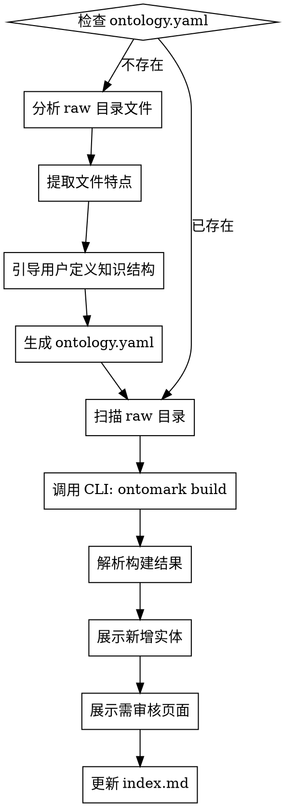
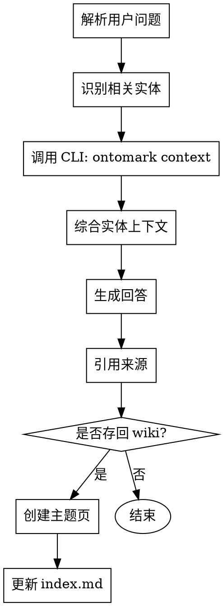
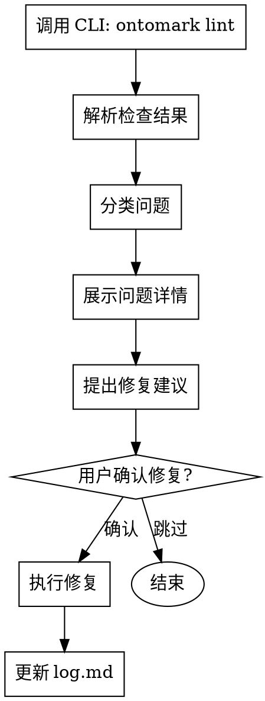

# OntoMark Skill 设计文档

## 概述

将 OntoMark V2 的知识编译流程集成到 Claude Code 中，通过 Skill 编排 CLI 命令，实现 LLM Wiki 模式。

## 核心理念

**Compile Once, Query Many** - 预先编译知识，而非查询时合成。

三层架构：
- `raw/` - 不可变的原始资料
- `wiki/` - LLM 编译的知识层
- `ontology.yaml` - 知识组织规则

## CLI 与 Skill 职责划分

| 职责 | CLI | Skill |
|-----|-----|-------|
| 原子操作实现 | ✅ | ❌ |
| 工作流编排 | ❌ | ✅ |
| 用户交互引导 | ❌ | ✅ |
| Ontology 设计 | ❌ | ✅ |
| 结果解释展示 | ❌ | ✅ |

## 文件结构

```
skills/ontomark/
  SKILL.md                    # 入口 + 核心概念
  reference/
    ingest-workflow.md        # Ingest 详细工作流
    query-workflow.md         # Query 详细工作流
    lint-workflow.md          # Lint 详细工作流
```

---

## SKILL.md

```markdown
---
name: ontomark
description: Use when building or querying an OntoMark wiki knowledge base. Triggers for ingesting new sources, answering questions about the wiki, or health-checking the knowledge graph.
---

# /ontomark

Ontology-Driven AI Native Wiki Builder - 将文档编译成持久化的知识图谱。

## 核心理念

**Compile Once, Query Many** - 不是查询时合成，而是预先编译知识。

## 三层架构

```
raw/          ← 不可变的原始资料
wiki/         ← LLM 编译的知识层
ontology.yaml ← 知识组织规则
```

## 何时使用

| 用户意图 | 调用 |
|---------|------|
| 添加/更新源文档 | `/ontomark ingest` |
| 查询知识库 | `/ontomark query "<问题>"` |
| 健康检查 | `/ontomark lint` |
| 查看状态 | `/ontomark status` |

## CLI 依赖

本 Skill 需要安装 `ontomark` CLI：

```bash
npm install -g ontomark
# 或项目本地
npm install ontomark
```

## 工作流详细说明

- [Ingest 工作流](reference/ingest-workflow.md)
- [Query 工作流](reference/query-workflow.md)
- [Lint 工作流](reference/lint-workflow.md)

## 必须遵循的规则

1. **raw/ 不可修改** - 只能读取，所有修改在 wiki/ 层
2. **needs_review 页面需审核** - 不要直接使用，需人工确认
3. **答案可存回 wiki** - 好的查询答案可编译成新页面

## 常见错误

| 错误 | 解决方案 |
|-----|---------|
| 未设置 API Key | 设置 DEEPSEEK_API_KEY 或 OPENAI_API_KEY |
| raw 目录为空 | 先添加源文档到 raw/ |
| wiki 无内容 | 运行 `ontomark build <path>` |
```

---

## Ingest 工作流

参见 `reference/ingest-workflow.md`：

```markdown
# Ingest 工作流

添加新源文档，LLM 提取实体，更新 wiki 知识库。

## 使用方式

```
/ontomark ingest                     # 处理当前目录
/ontomark ingest <path>              # 处理指定目录
/ontomark ingest <path> --update     # 仅处理新增/变更文件
/ontomark ingest <url>               # 下载 URL 内容到 raw/ 后处理
```

## 工作流步骤



## 前置：Ontology 发现与设计

**当 ontology.yaml 不存在时，必须先完成此步骤。**

### Step 1: 分析 raw 目录

```bash
# 扫描 raw 目录结构
find <raw-path> -name "*.md" | head -20

# 分析文件内容特点
# 随机抽取 3-5 个文件，提取：
# - 文档主题领域
# - 常见实体类型（人物、组织、地点、事件等）
# - 文档结构特征
```

### Step 2: 展示分析结果

向用户展示：

```
📋 文档分析结果

文档数量：N 个
文件分布：
  - 目录1: M 个文档
  - 目录2: K 个文档
  ...

文档特点：
  - 领域：新闻/技术文档/学术论文/会议纪要/...
  - 常见内容：时事报道、技术说明、人物访谈...
  - 实体类型：人物、组织、地点、事件、概念...
```

### Step 3: 引导用户定义知识结构

**必须逐一询问，不可跳过：**

**问题 1：知识使用场景**
> "你打算如何使用这个知识库？"
> - A. 查询特定实体信息（"X 是谁？"）
> - B. 追踪事件发展（"X 事件的时间线"）
> - C. 发现实体关系（"X 和 Y 有什么关联"）
> - D. 其他：______

**问题 2：实体类型定义**
> "根据文档分析，建议以下实体类型。需要调整吗？"
> 
> | 类型 | 描述 | 信息字段 |
> |-----|------|---------|
> | Person | 人物 | role, organization |
> | Organization | 组织 | type, headquarters |
> | ... | ... | ... |
>
> - A. 使用建议结构
> - B. 添加类型：______
> - C. 删除类型：______
> - D. 修改字段：______

**问题 3：关系类型（可选）**
> "需要追踪实体间的关系吗？"
> - A. 不需要，只需实体信息
> - B. 需要，建议关系：
>   - works_for: Person → Organization
>   - located_in: Location → Location
>   - ...

### Step 4: 生成 ontology.yaml

根据用户确认的内容生成：

```yaml
version: "1.0"
entity_types:
  Person:
    description: 人物描述
    template:
      info:
        - key: role
          label: 角色/职位
        - key: organization
          label: 所属组织
  # ... 其他类型
relations:
  works_for:
    description: 就职于
    from: Person
    to: Organization
  # ... 其他关系
```

**写入后确认：**
> "已生成 ontology.yaml，内容如下：[展示内容]"
> "确认无误后，开始构建 wiki？"

## CLI 调用

```bash
ontomark build <project-path> --provider deepseek
```

## 结果展示模板

```
✅ 构建完成！耗时 Xs

新增实体：
  - Person: 实体名 (来源: 文档.md)
  - Organization: 实体名 (来源: 文档.md)
  ...

需审核页面：N 个
  - 实体名：原因（同名不同类型/低置信度）

下一步建议：
  1. 运行 `/ontomark lint` 检查知识库健康状态
  2. 审核标记页面后可运行 `/ontomark query` 查询
```

## Ontology 演化

**当用户反馈提取效果不佳时：**

1. 分析问题：遗漏实体、类型错误、字段缺失
2. 提出 ontology 修改建议
3. 确认后更新 ontology.yaml
4. 重新运行 build

```
用户反馈：人物的组织信息没有提取

Agent 分析：Person 类型的 template.info 缺少 organization 字段

建议修改：
  entity_types:
    Person:
      template:
        info:
          + - key: organization
              label: 所属组织

确认修改？[Y/n]
```

## 必须遵循的规则

1. **首次 ingest 必须引导 ontology 设计** - 不可使用默认模板
2. **逐一询问，不可跳过** - 确保知识结构符合用户场景
3. **根据反馈演化** - ontology 应随使用场景调整
4. **raw/ 不可修改** - 只能读取，所有修改在 wiki/ 层
```

---

## Query 工作流

参见 `reference/query-workflow.md`：

```markdown
# Query 工作流

查询 wiki 知识库，综合回答用户问题，可选将答案存回 wiki。

## 使用方式

```
/ontomark query "<问题>"              # 查询知识库
/ontomark query "<问题>" --save       # 查询并将答案存回 wiki
```

## 工作流步骤



## CLI 调用

```bash
# 获取单个实体上下文
ontomark context <entity-name> <project-path>
```

## 查询类型与处理

| 查询类型 | 示例 | 处理方式 |
|---------|------|---------|
| 实体查询 | "X 是谁？" | 单实体 context，返回摘要 |
| 关系查询 | "X 和 Y 什么关系？" | 多实体 context，追踪链接 |
| 事件查询 | "X 事件的时间线" | 相关实体聚合，按时间排序 |
| 概念查询 | "什么是 X？" | 搜索匹配实体，返回定义 |

## 回答模板

```markdown
## <实体名>

**类型**：Person

**摘要**：
[实体摘要内容，来自 context 命令]

**相关实体**：
- [[实体A]] - 关系说明
- [[实体B]] - 关系说明

**来源**：
- 文档1.md (line 10)
- 文档2.md (line 25)
```

## 答案存回 Wiki

**LLM Wiki 核心理念：好的答案应该存回知识库。**

当用户使用 `--save` 或回答质量较高时，建议：

```
这个回答综合了多个实体信息，是否存回 wiki？

建议页面名：Topics/<问题主题>.md

存入后可以：
- 下次直接引用，无需重新综合
- 作为知识积累，持续丰富
```

创建主题页格式：

```markdown
---
entity_type: Topic
generated_from:
  - query: "用户原始问题"
  - entities: [Entity1, Entity2]
  - date: 2026-06-12
---

# <主题标题>

[综合回答内容]

## 相关实体
- [[Entity1]]
- [[Entity2]]

## 来源
- [[文档1]]
- [[文档2]]
```

## 无法找到实体时

```
未在 wiki 中找到 "X"。

可能原因：
1. 该实体尚未从 raw 文档中提取
2. 实体名称不同，尝试：[别名建议]
3. 需要先运行 `/ontomark ingest` 更新知识库

是否需要我：
- 在 raw 文档中搜索相关内容？
- 更新 ontology 以支持此实体类型？
```

## 多跳查询

当问题需要跨多个实体追踪时，展示路径：

```
X → works_for → Y → participated_in → Z

X 在 Y 组织工作，Y 参与了 Z 事件。
```

## 必须遵循的规则

1. **必须引用来源** - 每个回答必须标注 wiki 页面或 raw 文档来源
2. **优先使用 wiki** - 不要重新阅读 raw，使用已编译的知识
3. **建议存回** - 高质量答案主动建议存回 wiki
4. **诚实标识不确定** - 低置信度实体需标注 `需审核`
```

---

## Lint 工作流

参见 `reference/lint-workflow.md`：

```markdown
# Lint 工作流

健康检查 wiki 知识库，发现问题并提出修复建议。

## 使用方式

```
/ontomark lint                      # 检查知识库健康状态
/ontomark lint --fix                # 检查并自动修复可修复的问题
```

## 工作流步骤



## CLI 调用

```bash
ontomark lint <project-path>
```

输出解析：
- `孤立页面` - 无入链的 wiki 页面
- `缺失链接` - 被引用但未创建的实体
- `空页面` - 内容过少的页面
- `低置信度` - confidence < 0.5 的实体
- `需审核` - needs_review: true 的页面

## 问题类型与修复方案

| 问题类型 | 严重程度 | 自动修复 | 修复方案 |
|---------|---------|---------|---------|
| **孤立页面** | 中 | ✅ | 添加入链：在相关页面引用 |
| **缺失链接** | 高 | ❌ | 创建缺失实体页面或更新引用 |
| **空页面** | 高 | ❌ | 补充内容：重新提取或人工编辑 |
| **低置信度** | 中 | ❌ | 人工审核后确认/删除 |
| **需审核** | 高 | ❌ | 必须人工确认 |

## 结果展示模板

```
📊 Wiki 健康检查结果

总问题数：N 个

🔴 高优先级（需人工处理）
  - 缺失链接：M 个
    - "EntityX" 被 3 个页面引用但无对应 wiki 页面
    - 建议：检查是否需创建新页面，或修正引用名称
    
  - 需审核：K 个
    - "EntityY" 存在类型冲突（同时标记为 Person 和 Organization）
    - 建议：确认正确类型后更新
    
  - 空页面：P 个
    - "EntityZ" 内容少于 3 行
    - 建议：检查提取是否完整

🟡 中优先级（可自动修复）
  - 孤立页面：Q 个
    - Benjamin_Netanyahu
    - Rania_Khalek
    - 建议：在相关事件/组织页面添加引用

是否自动修复中优先级问题？[Y/n]
```

## 自动修复执行

**孤立页面修复：**

1. 找到与孤立实体相关的其他页面
2. 在这些页面中添加 `[[(孤立实体)]]` 链接
3. 更新 backlink 部分

## 深度检查

**发现矛盾：**

```
检测到潜在矛盾：

页面 A："X 成立于 2020 年"
页面 B："X 成立于 2019 年"

来源：
- A: 文档1.md
- B: 文档2.md

建议：
1. 检查原始文档确认正确信息
2. 更新其中一个页面
3. 标注矛盾来源
```

**发现缺失实体类型：**

```
检测到高频提及但无 wiki 页面的实体：

"EntityNew" 在 5 个文档中被提及
内容特征："EntityNew 是一家科技公司..."
建议添加：
  entity_types:
    EntityNew:
      description: ...
      type: Organization

是否创建此实体页面？[Y/n]
```

## Lint 后的 Agent 行为

1. **分类展示问题** - 按严重程度分组
2. **提供具体建议** - 不只列出问题，还给出修复方案
3. **确认后执行** - 自动修复需用户确认
4. **记录到 log** - 所有修复操作追加到 log.md

## 定期 Lint 建议

```
知识库建议维护频率：

| 文档规模 | 建议 lint 频率 |
|---------|--------------|
| < 50 个 | 每次 ingest 后 |
| 50-200 个 | 每周一次 |
| > 200 个 | 每次重要更新后 |

上次 lint：[日期]
当前状态：[健康/需修复]
```

## 必须遵循的规则

1. **区分自动/人工修复** - 明确标注哪些可自动修复
2. **高优先级必须展示** - 缺失链接和需审核页面必须处理
3. **修复后验证** - 执行修复后重新运行 lint 确认
4. **记录所有操作** - 每次修复追加到 log.md
```

---

## CLI 命令汇总

| 命令 | 用途 | Skill 调用时机 |
|-----|------|---------------|
| `ontomark init <path>` | 初始化项目 | 首次设置项目 |
| `ontomark build <path>` | 完整构建 | Ingest 工作流 |
| `ontomark lint <path>` | 健康检查 | Lint 工作流 |
| `ontomark context <entity> <path>` | 获取实体上下文 | Query 工作流 |
| `ontomark status <path>` | 查看状态 | 任意时刻 |

## 环境变量

```bash
# 必需
DEEPSEEK_API_KEY=sk-xxx   # DeepSeek API Key
# 或
OPENAI_API_KEY=sk-xxx     # OpenAI API Key
```

## 后续扩展

- MCP Server：将 wiki 暴露为 Agent 工具
- 增量更新：`--update` 模式只处理变更文件
- 多项目支持：切换不同知识库
