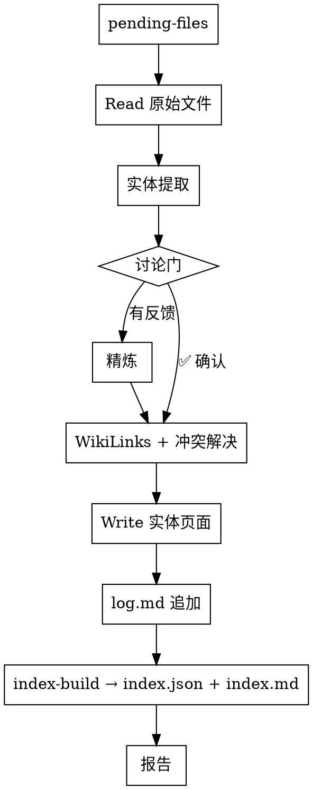

# Ingest 讨论门、log.md 与 index.md 设计

**日期：** 2026-06-25
**状态：** 设计已确认

## 概述

填补 current ingest/explore/query/lint 技能与 LLM_Wiki.md 设计之间的三个关键差距：

1. **讨论门** — 在 ingest 的提取和写入之间插入 human-in-the-loop 讨论环节
2. **log.md** — 追加式操作日志，记录所有 wiki 变更
3. **index.md** — 人机可读的 wiki 目录，由 index-build CLI 自动生成

---

## 1. 讨论门（P0）

### 目标

在实体提取之后、写入 wiki 之前，让用户参与讨论，确保提取方向正确。

### 工作流变更

将 ingest 的工作流从：

```
Read → 提取 → WikiLinks → 冲突解决 → Write
```

改为：

```
Read → 提取 → **讨论门** → 精炼 → WikiLinks → 冲突解决 → Write → log.md → index-build
```

### 讨论门的流程

#### 步骤 A：展示关键发现

AI 提取完成后，向用户展示结构化摘要：

```
📖 文档：raw/tech/ai-tools.md — "2026年中国AI编程工具市场"

关键发现：
├─ 核心实体：[[DeepSeek-Coder]]（Thing/编程工具）
├─ 关联实体：[[AI编程工具市场]]（Event/市场事件）
├─ 涉及组织：[[深度求索]]（Organization/AI公司）
└─ 已有实体更新：[[OpenAI Codex]] 补充竞争对手信息

你觉得这个方向对吗？要调整重点还是继续？
```

展示内容包括：
- 文档标题/摘要
- 建议新建的实体（名称 + 类型 + 提取依据）
- 建议更新的已有实体（名称 + 变更说明）
- 整体置信度评估

#### 步骤 B：用户反馈

用户可选择：

| 反馈类型 | 示例 | AI 响应 |
|---------|------|---------|
| **确认** | "可以，继续" | 跳过精炼，直接进入 WikiLinks 阶段 |
| **补充** | "DeepSeek 的定价信息也重要" | 重新提取，补充定价属性 |
| **修正** | "这个不叫 AI编程工具市场，叫 AI工具市场" | 修正实体名称后继续 |
| **重定向** | "我更关注它和 GitHub Copilot 的对比" | 重新搜索相关段落，调整提取重点 |
| **否定** | "这个文档不重要，跳过" | 跳过当前文件，不写入 |

#### 步骤 C：精炼提取

AI 根据用户反馈调整提取结果，然后继续 WikiLinks 标注阶段。

### 模式适配

| 模式 | 行为 |
|------|------|
| 逐一模式（≤3 文件） | 每个文件单独展示讨论门，逐轮确认 |
| 批量模式（>3 文件） | 合并所有文件的发现摘要，用户批量确认后统一写入 |

### 与 explore 的关系

`ontomark-explore` 已在"建议与确认"阶段实现了类似的交互（Phase 3），但最终执行写入时复用的是 ingest 的提取流程。讨论门在 ingest 中的加入，也让 explore 的最终写入阶段获得同样的讨论能力。

---

## 2. log.md（P1）

### 文件位置

```
{projectRoot}/log.md
```

与 `ontology.md` 同级，在项目根目录，不在 wiki 内。

### 格式

```markdown
## [2026-06-25] ingest | 2026年中国AI编程工具市场

type: ingest
files: ["raw/tech/ai-tools.md"]
entities:
  - + DeepSeek-Coder (Thing)
  - + AI编程工具市场 (Event)
  - ~ OpenAI Codex (updated)
status: success
---
```

**设计原则：**
- **追加不修改** — 每条记录用 `---` 分隔，一旦写入永不更改
- **前缀可 grep** — `## [YYYY-MM-DD]` 格式标准，`grep "^## \[" log.md | tail -5` 即最近 5 条
- **结构化元数据** — `type/entities/status` 键值对在标题下方，便于工具解析
- **操作类型统一** —

| type 值 | 来源操作 | 追加时机 |
|---------|---------|---------|
| `ingest` | ontomark-ingest | 写入实体后、index-build 前 |
| `explore` | ontomark-explore | 写入实体后 |
| `query` | ontomark-query | 存储 Topic 页面后 |
| `lint` | ontomark-lint | 修复完成并 index-build 后 |

### 实体列表格式

每个实体一条记录：

| 前缀 | 含义 |
|------|------|
| `+` | 新建实体 |
| `~` | 更新现有实体 |
| `-` | 废弃/删除实体 |

### 实现方式

在各技能的收尾阶段，使用 **Write 工具** 在 `{projectRoot}/log.md` 末尾追加内容。如果文件不存在则新建。

---

## 3. index.md（P1）

### 文件位置

```
{outputDir}/index.md
```

在 wiki 根目录下，与实体类型目录同级。

### 格式

```markdown
# Wiki Index

_最后更新：2026-06-25 | 共 12 个实体_

## Actor

- [[Sam Altman]] — OpenAI CEO，AI 安全倡导者 _(2026-06-25)_
- [[Sidney Crosby]] — NHL 冰球运动员 _(2026-06-24)_

## Organization

- [[OpenAI]] — AI 研究与部署公司 _(2026-06-25)_
- [[Amazon]] — 电商与云计算巨头 _(2026-06-20)_

## Thing

- [[ChatGPT]] — OpenAI 的 AI 对话助手 _(2026-06-25)_
- [[DeepSeek-Coder]] — AI 编程工具 _(2026-06-25)_
```

### 生成方式

功能追加到 `ontomark index-build <project-path>` 命令中。

`index-build` 当前已经在做：
1. 扫描 outputDir 下所有 `.md` 文件
2. 解析 YAML frontmatter 获取 `canonical`、`type`、`aliases`
3. 构建 `.ontomark/index.json`

新增行为：
4. 读取每个实体页面的第一段正文，提取一句话摘要
5. 按 `type` 分组
6. 生成 `outputDir/index.md`

### 一句话摘要提取规则

| 来源 | 策略 |
|------|------|
| frontmatter 有 `description` | 优先使用 |
| 无 description | 取正文第一段（`# 标题` 后的第一段 prose），截取前 100 字符 |
| 第一段为空 | 取 `# 标题` 本身作为摘要 |

### 更新时机

`index.md` 由 `index-build` 全量重建，因此每次 ingest/explore/lint 完成后调用 `index-build` 时自动更新，无需额外步骤。

---

## 关联变更总览

| 文件 | 变更内容 |
|------|---------|
| `skills/ontomark-ingest/SKILL.md` | ① 工作流增加讨论门 ② 收尾追加 log.md |
| `skills/ontomark-explore/SKILL.md` | 收尾追加 log.md |
| `skills/ontomark-query/SKILL.md` | 存储 Topic 时追加 log.md |
| `skills/ontomark-lint/SKILL.md` | 修复完成时追加 log.md（可选，当前 lint 能力不足） |
| `src/v3/tools/index-build.ts` | index.md 生成逻辑 |
| `src/v3/tools/index-query.ts` | 无变更（query 不变） |
| `src/v3/tools/types.ts` | 无变更 |
| CLI 命令 | `index-build` 输出 index.md，无接口变更 |

### Ingest 完整工作流（最终形态）


