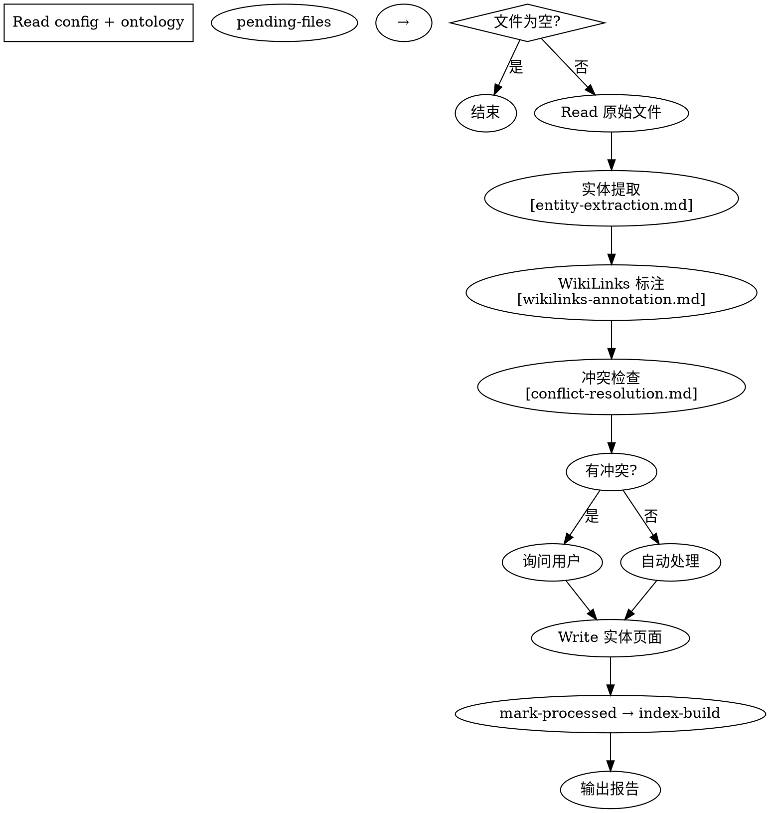

# Ingest 工作流

从原始文档或对话记录中提取实体，写入结构化的 wiki 知识库。

> **前置条件**：项目已通过 `/ontomark-init` 初始化，存在 `.ontomark/config.json` 和 `ontology.md`。

## 工作流



### ① 准备

1. **Read** `.ontomark/config.json` — 获取 `inputDirs` 和 `outputDir`
2. **Read** `ontology.md` — 获取实体类型定义（注入提取提示词用）
3. **pending-files** — 获取待处理文件：
   ```bash
   ontomark pending-files <project-path>
   ```
   返回：
   ```json
   { "files": ["raw/a.md", "raw/b.md"], "total": 2, "lastHash": "abc123" }
   ```
   - `files` 为空 → 无待处理，结束流程

### ② 读取

4. 对每个待处理文件：**Read** 原始内容
   - Markdown 文件直接读全文
   - 其他格式（代码、文本等）也直接读取

### ③ 提取

5. **实体提取** — 遵循 [reference/entity-extraction.md](reference/entity-extraction.md) 的三层策略：
   - 第一层：直接识别（明确提及的名称）
   - 第二层：上下文推断（代词、隐含地点/时间）
   - 第三层：全局总结（概念性实体）

   将步骤 2 读到的 `ontology.md` 实体类型注入提示词。

6. **WikiLinks 标注** — 遵循 [reference/wikilinks-annotation.md](reference/wikilinks-annotation.md)：
   - 对提取结果做 WikiLinks 标注
   - 对每个实体调用 `index-query` 检查是否存在：
     ```bash
     ontomark index-query <project-path> "<name>" [--fuzzy]
     ```
   - `found: true` → 使用现有 canonical 做链接目标
   - `found: false` → 使用提取的 name 做链接目标

### ④ 冲突解决

7. 对每个提取的实体，按 [reference/conflict-resolution.md](reference/conflict-resolution.md) 处理：

   | 条件 | 操作 |
   |------|------|
   | 不存在 | 直接新建，无需确认 |
   | 完全一致 | 跳过 |
   | 新增别名/补充 info | 自动合并 |
   | info 冲突 | 询问用户 |
   | 类型不匹配 | 询问用户 |

### ⑤ 写入

8. **Write** 实体页面到 `{outputDir}/{EntityType}/{CanonicalName}.md`
   - 新建：完整 frontmatter + 正文
   - 更新：Read 现有文件 → 合并 aliases、sources、正文 → 重新写入
   - 格式见下方"实体页面格式"
   - **sources 增强**：每个来源记录 `file` 和 `context`（段落位置）

9. **标记已处理**：
   ```bash
   ontomark mark-processed <project-path>
   ```

10. **重建索引**：
    ```bash
    ontomark index-build <project-path>
    ```

### ⑥ 报告

11. 向用户展示输出报告。

---

## CLI 命令参考

| 命令 | 作用 | 输出关键字段 |
|------|------|-------------|
| `ontomark pending-files <path>` | 待处理文件 | `files[], total, lastHash` |
| `ontomark mark-processed <path>` | 标记 HEAD 为已处理 | ✅ 确认信息 |
| `ontomark index-build <path>` | 全量重建索引 | 索引实体数 |
| `ontomark index-query <path> <name> [--fuzzy]` | 查询实体 | `found, canonical?, type?, path?, aliases?` |
| `ontomark wiki-status <path>` | wiki 状态 | `files[], total` |

---

## 实体页面格式

```markdown
---
canonical: Sam Altman
type: Actor
aliases: [Altman, Sam, 山姆·奥特曼]
status: active
tags: [科技领袖]
provenance:
  - source: raw/article.md
    cite: 第三段
    retrieved: 2026-06-25
relations:
  - type: employs
    target: OpenAI
    label: CEO
updated: 2026-06-25
---

# Sam Altman

OpenAI 的 CEO，在 AI 领域有重要影响。

## 履历

- 2015 — 联合创立 [[OpenAI]]
- 2022-11 — 发布 [[ChatGPT]]
- 2023-11 — 被解雇后复职

## 关联实体

- [[OpenAI]] — 担任 CEO
- [[ChatGPT]] — 主导开发
```

| 字段 | 必填 | 说明 |
|------|------|------|
| `canonical` | 是 | 规范名称，全局唯一标识实体 |
| `type` | 是 | 知识维度，必须存在于 ontology.md |
| `aliases` | 否 | 别名，用于 index-query 模糊匹配 |
| `status` | 否 | `active`（默认）\| `stub` \| `needs_review` \| `deprecated` \| `redirect` |
| `redirect` | 否 | 当 `status=redirect` 时指向的目标 canonical |
| `tags` | 否 | 自由标签，不限定于 ontology 维度 |
| `relations` | 否 | 结构化关系声明：`{type, target, label?}` |
| `provenance` | 是 | 来源追溯：`{source, cite?, retrieved?}` 或 `{conversation, summary?}` |
| `updated` | 否 | ISO 8601 日期 |
| `needs_review` | 否 | `true` 表示需人工审核（兼容旧数据） |

---

## 决策矩阵

| 场景 | 行为 |
|------|------|
| 文件 ≤ 3 | 逐文件展示提取结果 → 用户确认后写入 |
| 文件 > 3 | 批量提取 → 展示摘要 → 用户批量确认 |
| 新实体 | 直接新建 |
| 完全重复 | 跳过 |
| 新增别名/补充 info | 自动合并 |
| info 冲突 | 询问用户 |
| 类型不匹配 | 询问用户 |
| 对话来源 | 默认 `needs_review: true` |

---

## 处理对话来源

当知识来源于对话而非文档时：

- **提取**用户明确提到的实体、修正或补充的信息、达成的共识
- **sources** 使用 `conversation` 字段：
  ```json
  { "conversation": "2026-06-25", "summary": "讨论了 Connor 最新数据" }
  ```
- 对话来源实体默认 `needs_review: true`
- 流程与文档提取一致，写入同一 wiki 目录

---

## 错误处理

| 场景 | 处理 |
|------|------|
| `.ontomark/config.json` 不存在 | 提示运行 `/ontomark-init`，中止 |
| `ontology.md` 不存在 | 提示运行 `/ontomark-init`，中止 |
| `pending-files` 失败 | 检查 git 仓库状态，中止 |
| `mark-processed` 失败 | 输出已写入的实体，提示手动标记 |
| 写入失败 | 检查路径和权限 |
| 非 git 仓库 | 提示 OntoMark 依赖 git 检测变更 |

---

## 输出报告

```markdown
## Ingest 完成

处理模式：{逐个/批量}
处理文件：{N} 个
├─ 新建实体：{N} 个
├─ 更新实体：{N} 个
├─ 跳过（重复）：{N} 个
└─ 需人工审核：{N} 个

提取来源：
├─ 直接识别：{N} 个
├─ 上下文推断：{N} 个
└─ 全局总结：{N} 个

实体类型分布：
├─ Person：{N} 个
├─ Event：{N} 个
└─ ...
```
